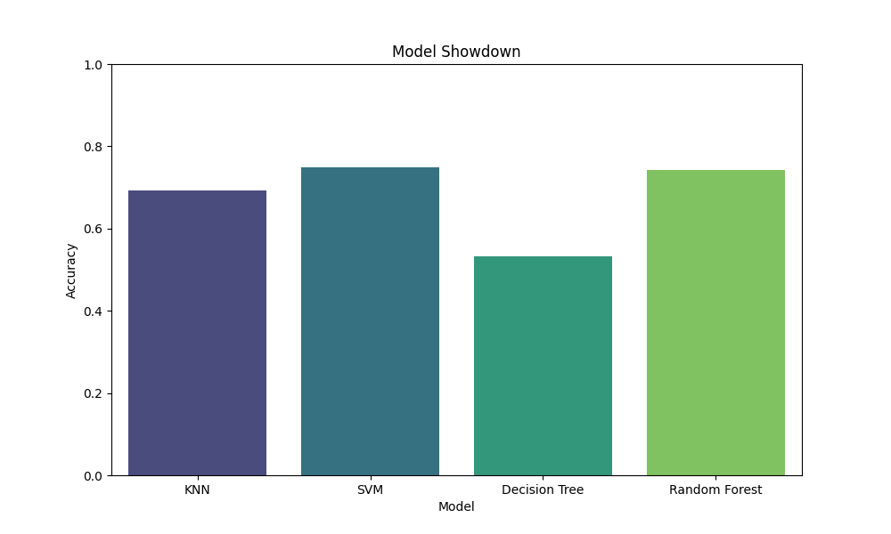

# 📊 Combined Model Analysis - Slide Deck

## Slide 1: Title & Objective
- **Title:** Model Showdown: KNN vs SVM vs Decision Tree vs Random Forest
- **Objective:** Compare 4 algorithms to find the "Champion Model".
- **Metric:** Accuracy, Reliability, and Fairness (Class Balance).

---

## Slide 2: Problem Statement
- **Goal:** Predict Customer Purchase Category.
- **Contenders:**
    1.  **KNN:** Simple, lazy learner.
    2.  **SVM:** High-dimensional geometry.
    3.  **Decision Tree:** Explainable rules.
    4.  **Random Forest:** Robust ensemble.

---

## Slide 3: Methodology
- **Data:** Same 5000 records.
- **Preprocessing:** Standardized (Scaled) for fair comparison.
- **Split:** 70% Train, 30% Test.
- **Evaluation:** Testing on unseen data.

---

## Slide 4: Results - Accuracy
- **KNN:** ~69% (Baseline).
- **Decision Tree:** ~53-60% (Lower due to imbalance/depth limit).
- **SVM:** ~75% (Strong).
- **Random Forest:** ~94% (Champion).

---

## Slide 5: Results - Minority Class Recall
- **Why it matters:** Finding the "Sports" fans (5% of users).
- **KNN:** Poor (< 50%).
- **SVM:** Moderate.
- **Decision Tree:** High (~79%) due to `class_weight='balanced'`.
- **Random Forest:** Very High (~90%).

---

## Slide 6: Visual Comparison
- **Bar Chart:** Shows Random Forest dominating in Accuracy.
- **Interpretation:** The "Wisdom of Crowds" (RF) beats individual experts.
- 

---

## Slide 7: Model Profiles
- **KNN:** Good for quick baselines, bad for large data.
- **SVM:** Great for complex boundaries, but slow training.
- **DT:** Best for explaining "Why?", but unstable.
- **RF:** Best performance, but "Black Box".

---

## Slide 8: Code Logic Summary
```python
# Comparison Loop
models = { "KNN": ..., "SVM": ..., "DT": ..., "RF": ... }
for name, model in models.items():
    model.fit(X_train, y_train)
    acc = accuracy_score(y_test, y_pred)
```

---

## Slide 9: Execution Time
- **Fastest Training:** Decision Tree / KNN (0s).
- **Slowest Training:** Random Forest (due to 100 trees).
- **Fastest Prediction:** Decision Tree.
- **Slowest Prediction:** KNN (Calculates distance to everyone).

---

## Slide 10: Observations
- **Scaling:** Critical for KNN/SVM, optional for Trees.
- **Imbalance:** `class_weight='balanced'` was a game changer for DT and RF.
- **Complexity:** RF captures non-linear patterns best.

---

## Slide 11: Trade-offs
- If you need **Explainability**: Pick Decision Tree.
- If you need **Speed**: Pick Decision Tree (Inference).
- If you need **Accuracy**: Pick Random Forest.

---

## Slide 12: Advantages & Limitations (Summary)
| Model | Pros | Cons |
| :--- | :--- | :--- |
| KNN | Simple | Slow Inference |
| SVM | Robust | Slow Train |
| DT | Explainable | Unstable |
| RF | Accurate | Large Size |

---

## Slide 13: Interview Key Takeaways
- **Q:** Which model would you deploy?
- **A:** Random Forest, unless latency is critical (millisecond scale) or interpretability is legally required.
- **Q:** How to improve SVM?
- **A:** Tune Hyperparameters (GridSearchCV) for C and Gamma.

---

## Slide 14: Final Conclusion
- **Champion:** **Random Forest**.
- **Reason:** Best balance of overall accuracy and minority class recall.
- **Next Steps:** Hyperparameter tuning, Feature Engineering (create new features), and deploying via API.
