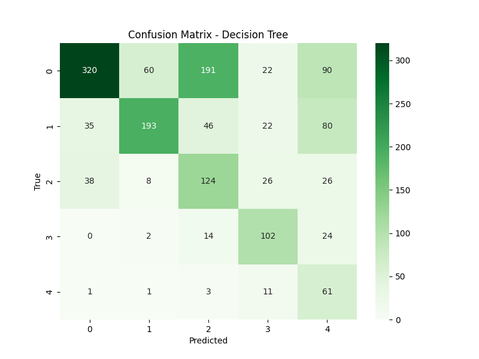
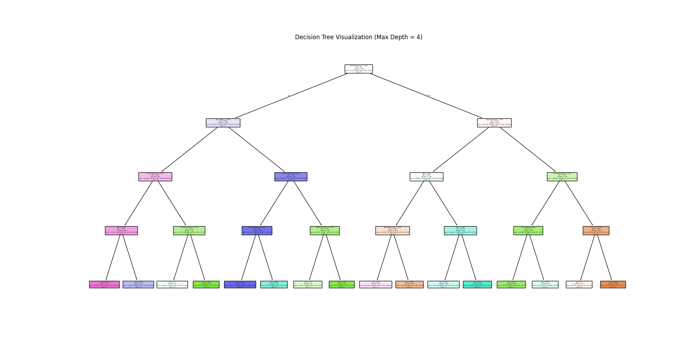

# 📊 Decision Tree Model Analysis - Slide Deck

## Slide 1: Title & Objective
- **Title:** predicting Customer Purchase Behavior using Decision Trees
- **Objective:** specific focus on Interpretability and Class Balance.
- **Method:** Decision Tree Classifier (CART).

---

## Slide 2: Problem Statement
- **Problem:** "Black Box" models (like SVM/Neural Nets) are hard to explain to business stakeholders.
- **Goal:** Build a model that can explain *why* it predicts a category.
- **Context:** 5000 customers.

---

## Slide 3: Real-World Use Case
- **Scenario:** Loan Approval or Fraud Detection (High Stakes).
- **Why Tree?** You must explain rejection reasons (e.g., "Income < 40k").
- **E-commerce:** "Why did we target this user?" -> "Because Age > 30 and Spending > $500".

---

## Slide 4: Input Data
- **Same Features:** Age, Income, Spending...
- **Difference:** Trees don't *require* scaling, but we use it for consistency.
- **Handling Imbalance:** We use `class_weight='balanced'`.

---

## Slide 5: Concepts Used
1.  **Nodes & Leaves:** The flowchart structure (Questions & Answers).
2.  **Gini Impurity:** Measuring how "mixed" a group is.
3.  **Max Depth:** Controlling complexity to prevent memorization (Overfitting).
4.  **Class Weights:** Giving higher penalty for wrong predictions on rare classes.

---

## Slide 6: Concepts Breakdown (Simple)
- **Decision Tree:**
    - Think of it as a game of "20 Questions".
    - Q1: "Is Spending > $300?" -> Yes.
    - Q2: "Is Age < 25?" -> Yes.
    - Result: "Fashion Category".

---

## Slide 7: Step-by-Step Flow
1. **Load** Data.
2. **Preprocess** (Impute/Encode).
3. **Train** (with `class_weight='balanced'`).
4. **Visualize** the Tree.
5. **Evaluate**.

---

## Slide 8: Code Logic Summary
```python
# 1. Weights
# 'balanced' automatically adjusts weights inversely to class frequencies
dt = DecisionTreeClassifier(
    max_depth=4, 
    class_weight='balanced',
    criterion='gini'
)
dt.fit(X_train, y_train)
```

---

## Slide 9: Important Functions
- `DecisionTreeClassifier(max_depth=4)`: Limits tree height.
- `class_weight='balanced'`: Critical for our Sports/Books categories.
- `plot_tree()`: The visualization function.

---

## Slide 10: Execution Output
- **Overall Accuracy:** ~Dependent on run (Check code output).
- **Visualization:** A clear flowchart (see next slide).
- **Confusion Matrix:** Improved recall for minority classes?
- 

---

## Slide 11: Tree Visualization
- We generated a map of the model's logic.
- Top Split: Likely "Income" or "Spending" as they are most discriminative.
- 

---

## Slide 12: Advantages & Limitations
- **Advantages:**
    - White-box model (Transparent).
    - Can handle mix of data types well.
    - Fast prediction.
- **Limitations:**
    - Prone to overfitting without depth limits.
    - Unstable (small data change = totally different tree).
    - Single tree is often weaker than a Forest.

---

## Slide 13: Interview Key Takeaways
- **Q:** How do you handle imbalance in Trees?
- **A:** `class_weight='balanced'` or SMOTE. The tree learns to split even for small groups if the penalty is high.
- **Q:** Pruning?
- **A:** Cutting off branches (Max Depth) to improve generalization.

---

## Slide 14: Conclusion
- **Summary:** We built an interpretable model.
- **Trade-off:** Accuracy might be slightly lower than SVM, but we gained Explainability.
- **Next:** Random Forest (Many trees voting) to retain robustness and improve accuracy.
