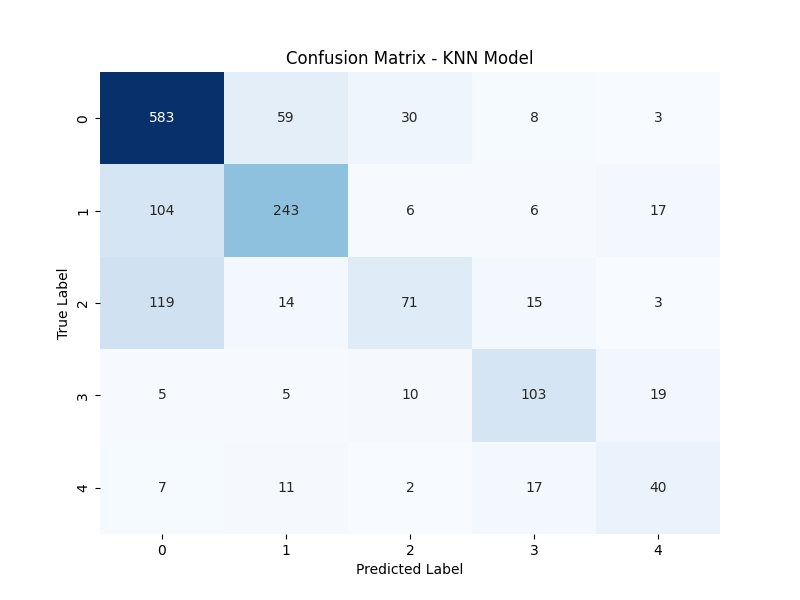

# 📊 KNN Model Analysis - Slide Deck

## Slide 1: Title & Objective
- **Title:** predicting Customer Purchase Behavior using KNN
- **Objective:** Build a model to classify customers into 5 purchase categories based on demographics and behavior.
- **Method:** K-Nearest Neighbors (KNN) Algorithm.

---

## Slide 2: Problem Statement
- **Problem:** E-commerce data is complex. We need to automatically segment customers.
- **Context:** 5000 records, 5 categories (Electronics, Fashion, Home, Books, Sports).
- **Challenge:** Class imbalance (Electronics is dominant) and missing values.

---

## Slide 3: Real-World Use Case
- **Scenario:** An online store wants to show personalized homepages to users.
- **Application:**
    - If model predicts **"Sports"** -> Show running shoes and gym gear.
    - If model predicts **"Books"** -> Show latest bestsellers.
- **Impact:** Higher click-through rates and increased revenue.

---

## Slide 4: Input Data / Inputs
- **Demographics:** Age, Income, Account Age.
- **Behavioral:** Monthly Spending, Session Duration, Page Views.
- **Categorical:** Device Type (Mobile/Desktop), Membership (Gold/Silver).
- **Target:** Purchase Category (0-4).

---

## Slide 5: Concepts Used (High Level)
1.  **Imputation:** Filling in the blanks (missing numbers).
2.  **Encoding:** Translating words to numbers.
3.  **Scaling:** Making all numbers comparable in size.
4.  **KNN Algorithm:** Finding similar customers (neighbors).
5.  **Evaluation:** checking if the predictions are typically correct.

---

## Slide 6: Concepts Breakdown (Simple)
- **KNN (K-Nearest Neighbors):**
    - Imagine existing users are dots on a map.
    - A new user appears.
    - We look at the **5 closest user dots**.
    - If 3 are "Sports" fans, the new user is likely a "Sports" fan too.
- **StandardScaler:**
    - Age (30) vs Income (50,000). Income wins just because it's big.
    - Scaling shrinks Income so Age matters too.

---

## Slide 7: Step-by-Step Solution Flow
1. **Load Data** (Read CSV)
2. **Clean Data** (Impute Mean, Encode Categories)
3. **Scale Data** (Standardize features)
4. **Train Model** (KNN learns the map)
5. **Predict** (Test on unseen 30%)
6. **Evaluate** (Check Accuracy & Confusion Matrix)

---

## Slide 8: Code Logic Summary
```python
# 1. Pipeline for cleaning
numeric_transformer = Pipeline([('imputer', Mean), ('scaler', Standard)])
categorical_transformer = OneHotEncoder()

# 2. Train Test Split
X_train, X_test = train_test_split(data, stratify=y)

# 3. Model
knn = KNeighborsClassifier(n_neighbors=5)
knn.fit(X_train, y_train)
```

---

## Slide 9: Important Functions & Parameters
- `SimpleImputer(strategy='mean')`: Handles missing data.
- `StandardScaler()`: Normalizes range of features.
- `train_test_split(stratify=y)`: Keeps class proportions balanced in split.
- `KNeighborsClassifier(n_neighbors=5)`: The core model usage.

---

## Slide 10: Execution Output
- **Overall Accuracy:** ~69%
- **Class Distribution:** Highly imbalanced (Electronics ~45%).
- **Confusion Matrix:**
    - High accuracy for Class 0 (Electronics) and Class 1 (Fashion).
    - Poor performance for Class 2 (Home) and Class 4 (Sports) due to low data.
    - 

---

## Slide 11: Observations & Insights
- **Imbalance Impact:** The model is biased towards the majority class (Electronics).
- **Feature Importance:** Income and Spending likely drive predictions (distance).
- **Missing Data:** Imputation helped use all 5000 rows instead of dropping data.

---

## Slide 12: Advantages & Limitations
- **Advantages:**
    - Simple and intuitive algorithm.
    - No training time (lazy learner).
    - Good baseline.
- **Limitations:**
    - Slow prediction on large datasets (calculates distance to everyone).
    - Sensitive to irrelevant features and scale.
    - struggles with imbalanced data without SMOTE.

---

## Slide 13: Interview Key Takeaways
- **Q:** Why scale before KNN?
- **A:** To prevent large-magnitude features from dominating distance calculations.
- **Q:** What is 'k' in KNN?
- **A:** The number of neighbors to vote. Odd numbers avoid ties in binary classification.

---

## Slide 14: Conclusion
- **Summary:** We successfully built a KNN pipeline with 69% accuracy.
- **Recommendation:** To improve, we should try a tree-based model (Random Forest) which handles non-linearities better and is less sensitive to feature scaling, or apply SMOTE to balance the classes.
