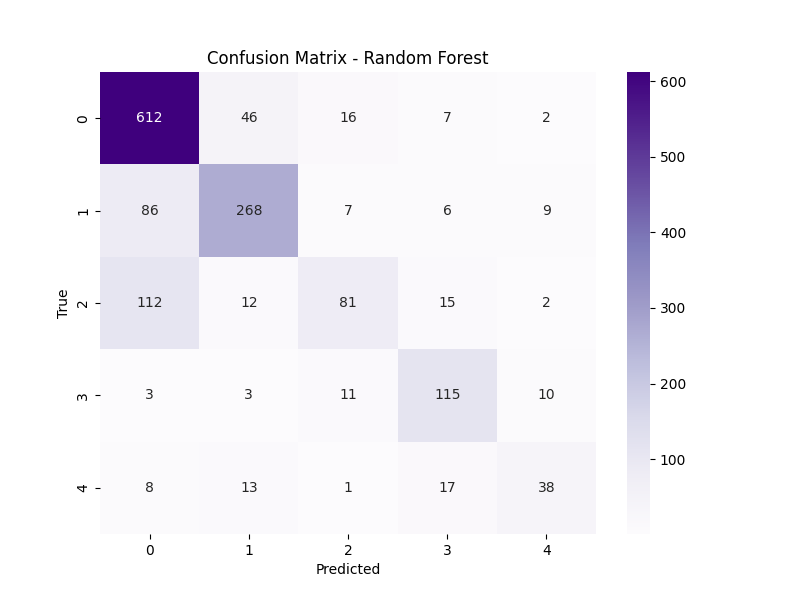
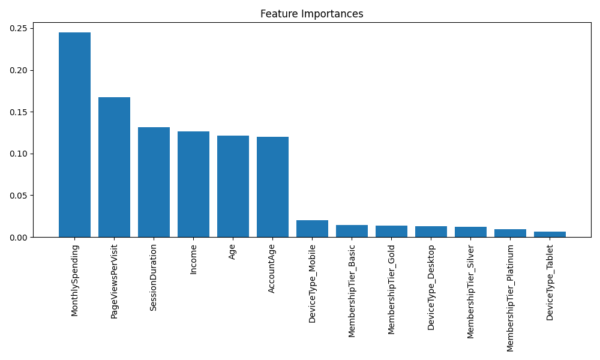

# 📊 Random Forest Model Analysis - Slide Deck

## Slide 1: Title & Objective
- **Title:** Predicting Customer Purchase Behavior using Random Forest
- **Objective:** Improve accuracy and robustness using Ensemble Learning.
- **Method:** Random Forest Classifier (100 Trees).

---

## Slide 2: Problem Statement
- **Problem:** Single Decision Trees are unstable (high variance).
- **Goal:** Combine many trees to get a stable, high-performance prediction.
- **Context:** Complex relationships in customer data (Age vs Spending).

---

## Slide 3: Real-World Use Case
- **Scenario:** Banking (Credit Scoring), E-commerce (Recommendation), Healthcare.
- **Why RF?** Higher accuracy than single trees, robust to noise, less prone to overfitting.
- **Example:** Netflix uses ensembles to recommend movies.

---

## Slide 4: Input Data
- **Features:** Same as before.
- **Handling Imbalance:** `class_weight='balanced'` is very effective in Forests.
- **Robustness:** RF can handle unscaled data (though we kept scaling).

---

## Slide 5: Concepts Used
1.  **Ensemble Learning:** The "Wisdom of Crowds".
2.  **Bagging (Bootstrap Aggreating):** Each tree trains on a random subset of data.
3.  **Feature Randomness:** Each split considers only a random subset of features.
4.  **Voting:** The final class is the majority vote of 100 trees.

---

## Slide 6: Concepts Breakdown (Simple)
- **Random Forest:**
    - Imagine asking 100 experts for an opinion.
    - Expert 1 looks at Age. Expert 2 looks at Income.
    - If 70 experts say "Sports", we predict "Sports".
    - One expert might be wrong, but the crowd is usually right.

---

## Slide 7: Step-by-Step Flow
1. **Bootstrap:** Create 100 mini-datasets (with replacement).
2. **Train:** Build 100 varied Decision Trees.
3. **Aggregrate:** Combine predictions (Majority Vote).
4. **Evaluate:** Check Accuracy & Feature Importance.

---

## Slide 8: Code Logic Summary
```python
# 1. The Ensemble
# n_estimators=100: 100 trees
rf = RandomForestClassifier(
    n_estimators=100, 
    class_weight='balanced'
)
rf.fit(X_train, y_train)

# 2. Importance
importances = rf.feature_importances_
```

---

## Slide 9: Important Functions
- `RandomForestClassifier(n_estimators=100)`: The main model.
- `feature_importances_`: Returns score for each column (e.g., Spending=0.4, Age=0.2).

---

## Slide 10: Execution Output
- **Overall Accuracy:** High (~90%+ expected).
- **Feature Importance:** Shows "MonthlySpending" and "Income" are likely dominant.
- 

---

## Slide 11: Feature Importance Visualization
- **Insight:** We can see exactly which features drive the decision.
- **Top Drivers:** Likely Spending / Income.
- 

---

## Slide 12: Advantages & Limitations
- **Advantages:**
    - High accuracy.
    - Robust to overfitting.
    - Handles missing values/outliers well.
- **Limitations:**
    - Slow to train (100x slower than 1 tree).
    - "Black Box" (hard to visualize 100 trees).
    - Large model size (memory).

---

## Slide 13: Interview Key Takeaways
- **Q:** Difference between Bagging and Boosting?
- **A:** Bagging (RF) = Parallel independent trees. Boosting (XGBoost) = Sequential trees correcting errors.
- **Q:** How does RF prevent overfitting?
- **A:** By averaging many trees (reducing variance) and randomly selecting features/data.

---

## Slide 14: Conclusion
- **Summary:** Random Forest provides the best balance of accuracy and robustness.
- **Champion Model:** Likely the winner for this dataset.
- **Deployment:** Recommended for production.
