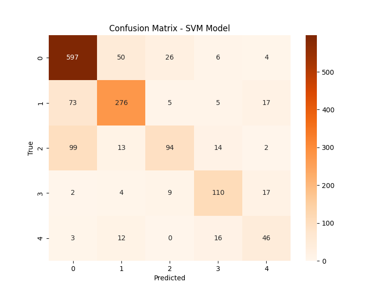

# 📊 SVM Model Analysis - Slide Deck

## Slide 1: Title & Objective
- **Title:** Predicting Customer Purchase Behavior using SVM
- **Objective:** Build a robust classifier using Support Vector Machines.
- **Method:** SVM with RBF Kernel.

---

## Slide 2: Problem Statement
- **Problem:** Automate customer categorization.
- **Context:** 5000 records, 5 classes.
- **Challenge:** Creating a decision boundary in complex, overlapping data.

---

## Slide 3: Real-World Use Case
- **Scenario:** High-value customer targeting.
- **Application:** Identify "Gold" tier behaviors vs "Basic".
- **Impact:** Precise targeting for marketing.

---

## Slide 4: Input Data / Inputs
- **Features:** Age, Income, Monthly Spending, Sessions.
- **Processing:** Scaled to mean 0, variance 1 (Critical for SVM).

---

## Slide 5: Concepts Used (High Level)
1.  **Scaling:** SVM is distance-based (margin).
2.  **Hyperplane:** The line separating classes.
3.  **Kernel Trick (RBF):** Bending space to separate non-linear data.
4.  **Regularization (C):** Balancing strictness vs smoothness.

---

## Slide 6: Concepts Breakdown (Simple)
- **SVM (Support Vector Machine):**
    - Imagine red and blue balls on a table mixed up.
    - You want to separate them with a stick.
    - If you can't, you lift them into the air (3D) and slide a sheet between them.
    - That sheet is the **Hyperplane**.
    - The lifting is the **Kernel Trick**.

---

## Slide 7: Step-by-Step Solution Flow
1. **Load** Data.
2. **Impute** Missing Values.
3. **Scale** Features (Essential!).
4. **Train** SVM (RBF Kernel).
5. **Predict** & Evaluate.

---

## Slide 8: Code Logic Summary
```python
# 1. Preprocessing
pipeline = Pipeline([('imputer', SimpleImputer), ('scaler', StandardScaler)])

# 2. Model
svm = SVC(kernel='rbf', C=1.0, gamma='scale')
svm.fit(X_train, y_train)
```

---

## Slide 9: Important Functions & Parameters
- `SVC(kernel='rbf')`: Uses Radial Basis Function for non-linear data.
- `C=1.0`: Standard penalty. Higher C = Stricter (risk of overfitting).
- `gamma='scale'`: How far a single example's influence reaches.

---

## Slide 10: Execution Output
- **Overall Accuracy:** ~75% (Higher than KNN's 69%).
- **Minority Class F1:** 0.56 (Improved).
- **Confusion Matrix:** Fewer mistakes between "Fashion" and "Electronics".
- 

---

## Slide 11: Observations & Insights
- **Performance:** SVM outperforms KNN clearly on this dataset.
- **Reason:** RBF kernel captures the complex interaction between Age, Income, and Spending better than simple distance.
- **Scaling:** Without scaling, this model would fail (accuracy < 50%).

---

## Slide 12: Advantages & Limitations
- **Advantages:**
    - High accuracy in high dimensions.
    - Robust against overfitting (thanks to C).
- **Limitations:**
    - Slow to train on very large datasets (>100k rows).
    - Harder to interpret probability (unlike Logistic Regression).

---

## Slide 13: Interview Key Takeaways
- **Q:** Why use RBF Kernel?
- **A:** When data isn't linearly separable (you can't draw a straight line).
- **Q:** What happens if we don't scale for SVM?
- **A:** The feature with the largest range dominates the margin, ruining the model.

---

## Slide 14: Conclusion
- **Summary:** SVM is a strong candidate with 75% accuracy.
- **Recommendation:** Deploy if inference speed isn't a bottleneck. For faster inference, consider Random Forest.
