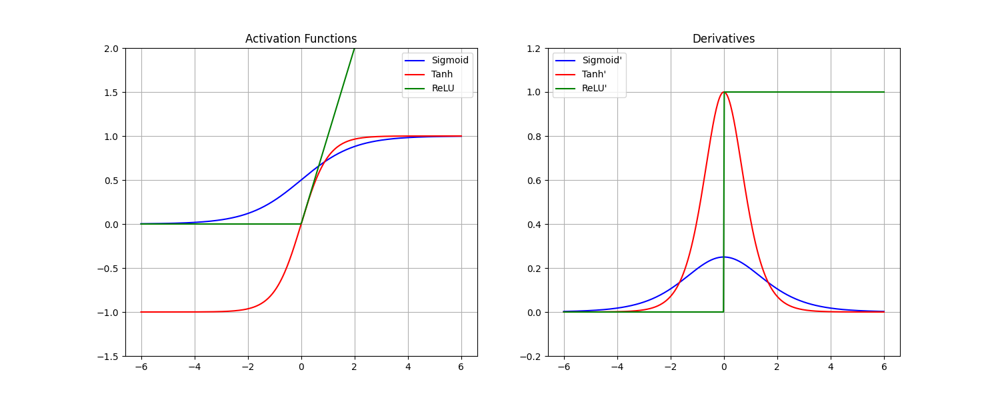

# Activation Functions Comparison Report

## 1. Problem Statement
**Compare Activation Functions Mathematically and Visually**
The objective is to implement, visualize, and analyze the three most common activation functions in neural networks: **Sigmoid**, **Tanh** (Hyperbolic Tangent), and **ReLU** (Rectified Linear Unit). This analysis focuses on their mathematical properties, derivatives, and behavior regarding the vanishing gradient problem.

## 2. Concept Explanation

### 2.1 Sigmoid
- **Definition**: Rescales input to a range between 0 and 1. Formula: $\sigma(z) = \frac{1}{1+e^{-z}}$
- **Why**: Interpretable as a probability.
- **When**: Output layer of binary classification models.
- **Where**: Historically used in hidden layers, now mostly restricted to output.
- **How**: Apply the formula to the neuron's weighted sum.

### 2.2 Tanh (Hyperbolic Tangent)
- **Definition**: Rescales input to a range between -1 and 1. Formula: $\tanh(z) = \frac{e^z - e^{-z}}{e^z + e^{-z}}$
- **Why**: Zero-centered output makes optimization easier than Sigmoid.
- **When**: Hidden layers of shallow networks or RNNs.
- **Where**: Intermediate layers where centering data around 0 is beneficial.
- **How**: Apply `np.tanh()`.

### 2.3 ReLU (Rectified Linear Unit)
- **Definition**: Outputs the input directly if positive, else zero. Formula: $R(z) = \max(0, z)$
- **Why**: Computational efficiency and solves vanishing gradient for positive inputs.
- **When**: Default choice for hidden layers in Deep Learning (CNNs, MLPs).
- **Where**: Almost all hidden layers in modern architectures.
- **How**: `max(0, input)`.

## 3. Advantages and Disadvantages

| Function | Advantages | Disadvantages |
| :--- | :--- | :--- |
| **Sigmoid** | Smooth gradient, outputs probability (0,1). | Vanishing gradient, not zero-centered, expansive exp calculation. |
| **Tanh** | Zero-centered, stronger gradient than Sigmoid. | Vanishing gradient problem still exists at extremes. |
| **ReLU** | Efficient, no vanishing gradient for $x>0$, fast convergence. | Dead ReLU problem (gradient is 0 for $x<0$), unbounded output. |

## 4. Written Analysis

### The Vanishing Gradient Problem
The derivative plots clearly show that **Sigmoid** and **Tanh** have gradients close to zero when the input is large (positive or negative).
- **Sigmoid Max Gradient**: 0.25 (at z=0). This quarters the error signal at each layer, making deep training impossible.
- **Tanh Max Gradient**: 1.0 (at z=0). Better, but still vanishes quickly as |z| > 2.
- **ReLU**: Gradient is constant 1.0 for all z > 0. This allows gradients to flow through deep networks without diminishing.

### Saturation Regions
- **Sigmoid Saturation**: $z < -4$ (output $\approx$ 0) and $z > 4$ (output $\approx$ 1).
- **Tanh Saturation**: $z < -2$ (output $\approx$ -1) and $z > 2$ (output $\approx$ 1).
- **ReLU**: Does not saturate for positive inputs.

### Preferences
- Prefer **ReLU** for hidden layers to ensure fast and effective training.
- Prefer **Sigmoid** only for the final output of binary classifiers.
- Prefer **Tanh** when inputs are normalized or in specific architectures like LSTMs/GRUs.

## 5. Implementation Steps
1.  **Definitions**: Implemented Python functions for Sigmoid, Tanh, ReLU and their derivatives using NumPy.
2.  **Visualization**: Used Matplotlib to generate 3 plots:
    - Raw activation functions over [-6, 6].
    - Derivatives over [-6, 6].
    - A comparison overview.
3.  **Numerical Analysis**: Evaluated functions at points $[-5, -2, -0.5, 0, 0.5, 2, 5]$ to inspect exact values and gradients.

## 6. Execution Output

### Plots
**Activation Functions & Derivatives Side-by-Side**

### Numerical Data
**Activation Outputs**
| Input | Sigmoid | Tanh | ReLU |
| :--- | :--- | :--- | :--- |
| -5.0 | 0.0067 | -1.0000 | 0.0000 |
| -0.5 | 0.3775 | -0.4621 | 0.0000 |
| 0.0 | 0.5000 | 0.0000 | 0.0000 |
| 0.5 | 0.6225 | 0.4621 | 0.5000 |
| 5.0 | 0.9933 | 1.0000 | 5.0000 |

**Gradient Analysis (Derivative Values)**
| Input | Sigmoid' | Tanh' | ReLU' |
| :--- | :--- | :--- | :--- |
| -2.0 | 0.1050 | 0.0707 (Weak) | 0.0000 (Dead) |
| 0.0 | 0.2500 (Max) | 1.0000 (Max) | 0.0000 |
| 2.0 | 0.1050 | 0.0707 (Weak) | 1.0000 (Strong) |

## 7. Observations
1.  **Sigmoid is weak**: Even at its peak (z=0), the gradient is only 0.25. This explains why it fell out of favor for hidden layers.
2.  **Tanh is steeper**: It is essentially a scaled sigmoid, but its gradient reaches 1.0, making it superior for shallow networks.
3.  **ReLU is asymmetric**: It is completely inactive for negative numbers (Dead ReLU risk) but linear for positive ones, combining non-linearity with the ease of optimising linear functions.

## 8. Conclusion
This analysis demonstrates why **ReLU** is the standard for modern deep learning: it avoids the vanishing gradient problem inherent in Sigmoid and Tanh. While Sigmoid is essential for probability estimation at the output, it inhibits learning in deep stacks. Tanh offers a zero-centered improvement but suffers similar saturation issues.
