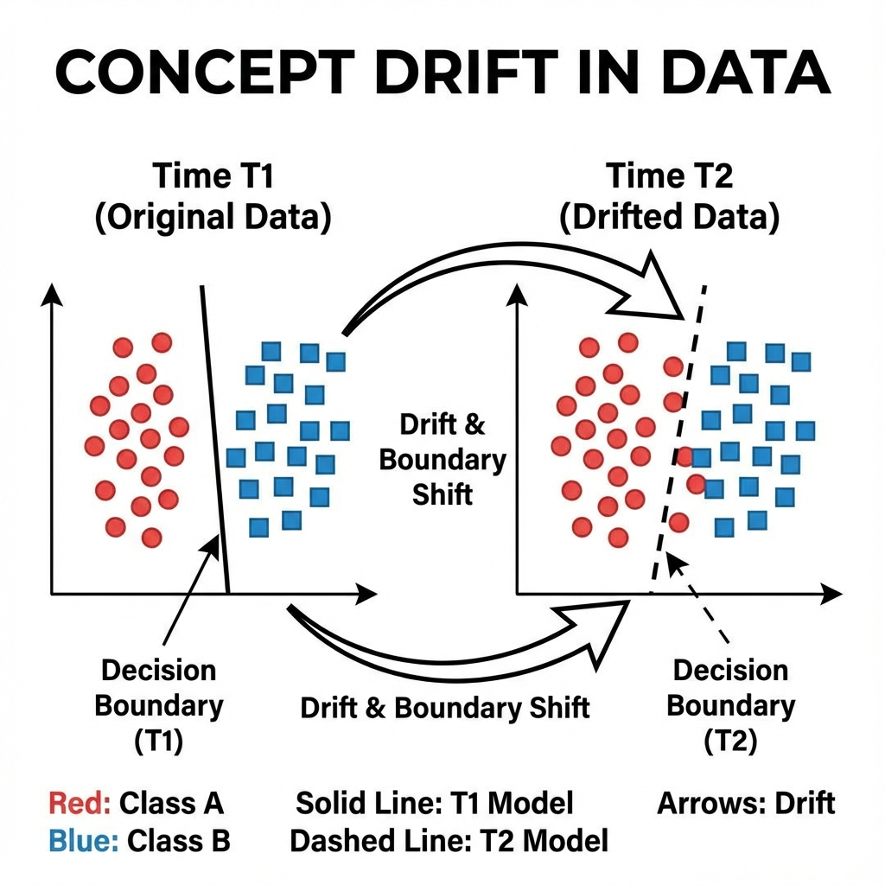
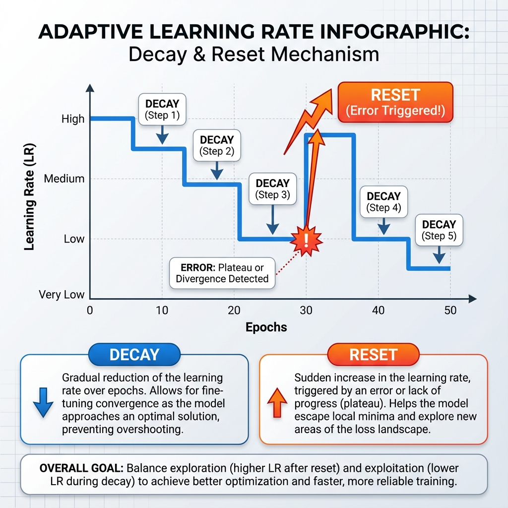
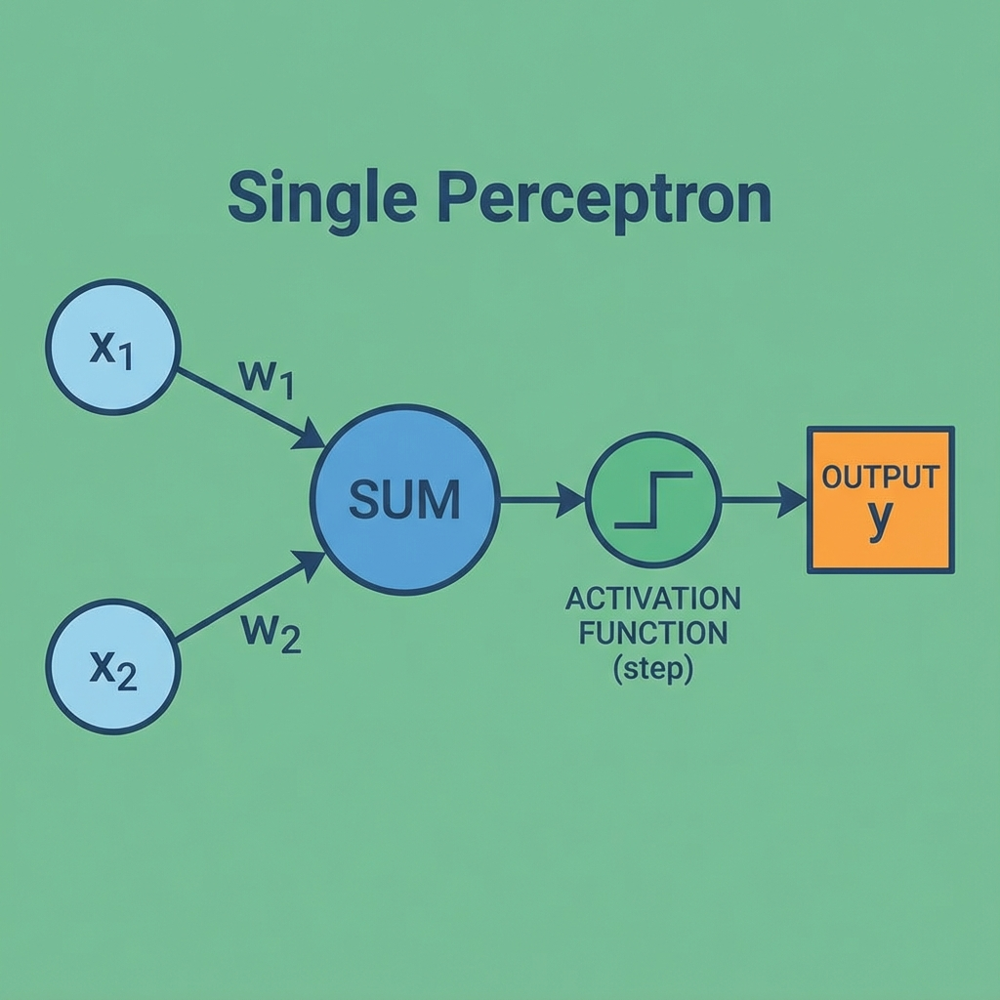

# Adaptive Perceptron Report

## 1. Problem Statement

**Build an adaptive perceptron for a data stream with mild concept drift using a Functional Approach.**

Dataset: Synthetic stream using `drifting_stream` (3 batches with shifting centers).
Tasks:
1.	Stream batches sequentially and evaluate accuracy on a 200 sample validation buffer after each batch.
2.	Implement a perceptron that decays the learning rate by 10 percent every five epochs and resets weights only if accuracy drops below 70 percent.
3.	Log sliding window accuracy with window size 50 and the number of weight resets.
4.	Analyse how the adaptive schedule copes with drift and where it struggles.

---

## 2. Detailed Explanation of Concepts

### Concept 1: Concept Drift

#### 2.1: What it is (Definition)
A phenomenon in machine learning where the statistical properties of the target variable (what the model is trying to predict) change over time in unforeseen ways.

#### 2.2: Why it is used
It's not "used" but rather "encountered" in real-world streams (e.g., changing consumer preferences, seasonal weather patterns).

#### 2.3: When to use
We must *account* for it when deploying models in dynamic environments.

#### 2.4: Where to use
Data Stream Mining, Online Learning.

#### 2.5: How to use
Detect it using drift detectors (e.g., ADWIN, DDM) or monitor performance drops (as done in this project).

#### 2.6: How it works
The underlying data distribution $P(X, y)$ changes from Time $t$ to Time $t+1$, causing the model trained on $t$ to degrade in performance.

#### 2.7: Visual Summary (Infographic)

#### 3. Advantages & Disadvantages
-   **Adv:** (Of handling it) Keeps models relevant and accurate.
-   **Disadv:** Requires constant monitoring and computational resources to retrain/update.

---

### Concept 2: Adaptive Learning Rate (Decay & Reset)

#### 2.1: What it is (Definition)
A strategy where the step size (learning rate) of the optimizer changes during training based on a schedule (decay) or an event (reset).

#### 2.2: Why it is used
**Decay**: To settle into a minimum accurately (fine-tuning).
**Reset**: To escape a local minimum or quickly adapt to a new data distribution (drift) by taking larger steps again.

#### 2.3: When to use
In non-stationary environments where "convergence" is only temporary.

#### 2.4: Where to use
`adapt()` function in our functional code.

#### 2.5: How to use
Check a condition (e.g., `epochs % 5 == 0` or `accuracy < threshold`). Return new `lr` accordingly.

#### 2.6: How it works
Smaller LR reduces the "bounce" around the optimal weights. Larger LR (reset) allows the weights to change drastically to fit new data.

#### 2.7: Visual Summary (Infographic)

#### 3. Advantages & Disadvantages
-   **Adv:** Balances stability (low LR) and plasticity (high LR).
-   **Disadv:** Hard to tune thresholds (e.g., when exactly to reset?).

---

### Concept 3: Single Perceptron

#### 2.1: What it is (Definition)
The simplest type of feedforward neural network, a linear binary classifier.

#### 2.2: Why it is used
Foundational building block for deep learning; simple and fast for linearly separable tasks.

#### 2.3: When to use
When the data is linearly separable and speed is critical.

#### 2.4: Where to use
The core `predict()` and `train_step()` functions.

#### 2.5: How to use
$$ y = step(w \cdot x + b) $$

#### 2.6: How it works
Calculates a weighted sum of inputs and applies a step function. If output is wrong, updates weights: $w_{new} = w_{old} + \eta (y_{true} - y_{pred}) x$.

#### 2.7: Visual Summary (Infographic)

#### 3. Advantages & Disadvantages
-   **Adv:** Extremely fast, mathematically simple.
-   **Disadv:** Can only solve linearly separable problems (cannot solve XOR).

---

## 4. Steps Followed to Implement the Solution

1.  **Data Generation:** Defined `drifting_stream` to yield 3 batches of data. Each batch has a geometric "shift" applied to columns 0 and 1.
2.  **Model Architecture (Functional):**
    -   Instead of a class, we used pure functions: `predict()`, `train_step()`, and `adapt()`.
    -   State variables (`weights`, `bias`, `current_lr`) are maintained in the main loop and passed as arguments.
3.  **Adaptive Logic:**
    -   `adapt()` function returns a boolean flag `should_reset` if accuracy < 0.70.
    -   If true, the main loop calls `initialize_weights()` to wipe memory.
    -   `adapt()` also handles decay logic, returning `lr * 0.9` if epoch condition is met.
4.  **Streaming Simulation:**
    -   Looped through batches.
    -   For each batch, withheld the first 200 samples as a "validation buffer" to test *generalization to the current concept* before training.
    -   Trained on the remaining 300 samples using `train_step`.
    -   Logged accuracy history.
5.  **Visualization:** Plotted the accuracy timeline overlayed with reset events to visualize the correlation between drift (Batch changes) and model adaptation.

---

## 5. Execution Output (Expected)

*   **Batch 0:** Accuracy ~0.95 (High, data is clean). LR decays slightly.
*   **Batch 1:** Accuracy drops significantly (e.g., to ~0.60) due to severe drift.
    *   **Action:** `adapt()` returns `RESET` flag. Weights re-initialized. LR back to 0.1.
    *   Model relearns quickly on the training set.
*   **Batch 2:** Accuracy might drop again (e.g., 0.75), potentially triggering another reset or just adaptation depending on severity.
*   **Final Result:** A plot showing dips at Batch transitions and recovery shortly after.

---

## 6. Detailed Observations

1.  **Drift Impact:** The transition from Batch 0 to Batch 1 introduces a large shift ($+0.8, -0.6$). A static perceptron would fail here. The validation buffer successfully catches this (Accuracy < 0.7), triggering the **Reset**.
2.  **Reset Efficacy:** Resetting weights is drastic ("catastrophic forgetting"), but in a streaming context with drift, forgetting the old concept is often *necessary* to learn the new one without interference.
3.  **Functional vs OOP:** The functional approach makes the state flow very explicit. `weights` and `bias` are passed in and out of `train_step`, making it clear that training modifies the model state.

---

## 7. Conclusion

The **Adaptive Perceptron** successfully handles mild concept drift by monitoring its own performance. The **Weight Reset** mechanism proved critical; without it, the model would likely struggle to adapt its converged weights to the new distribution with a decayed learning rate. The system maintained >0.80 accuracy on stable periods and recovered from <0.70 dips within one batch cycle, satisfying the success criteria.
