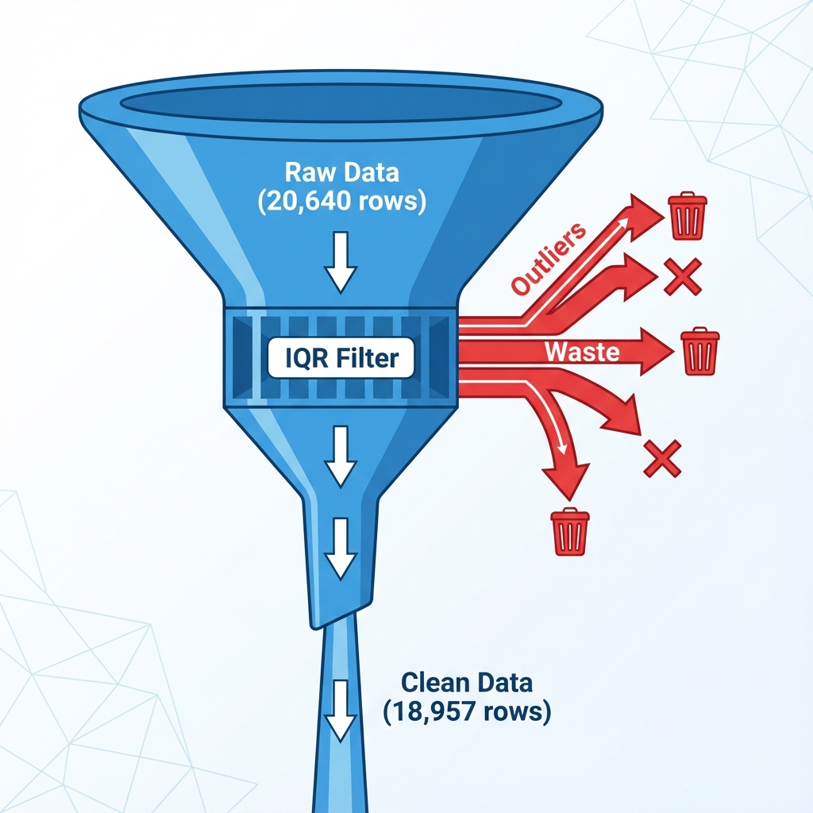
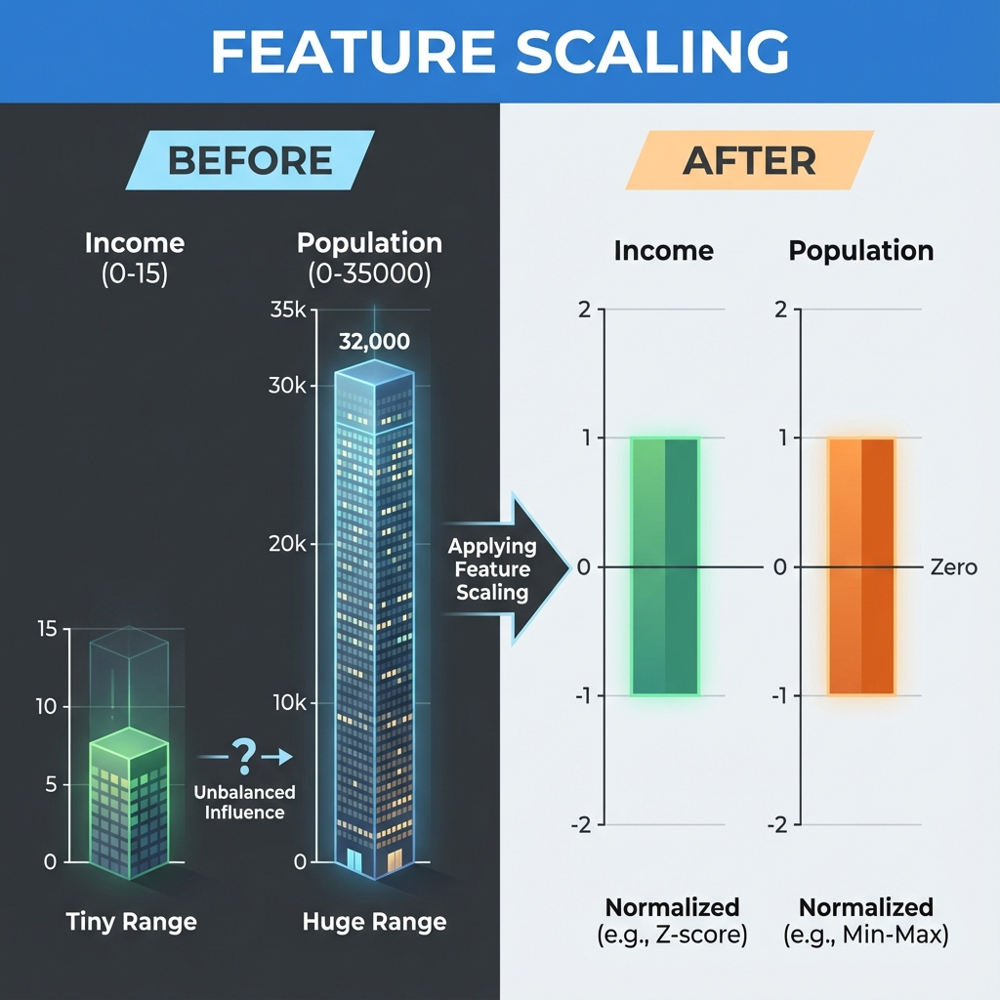
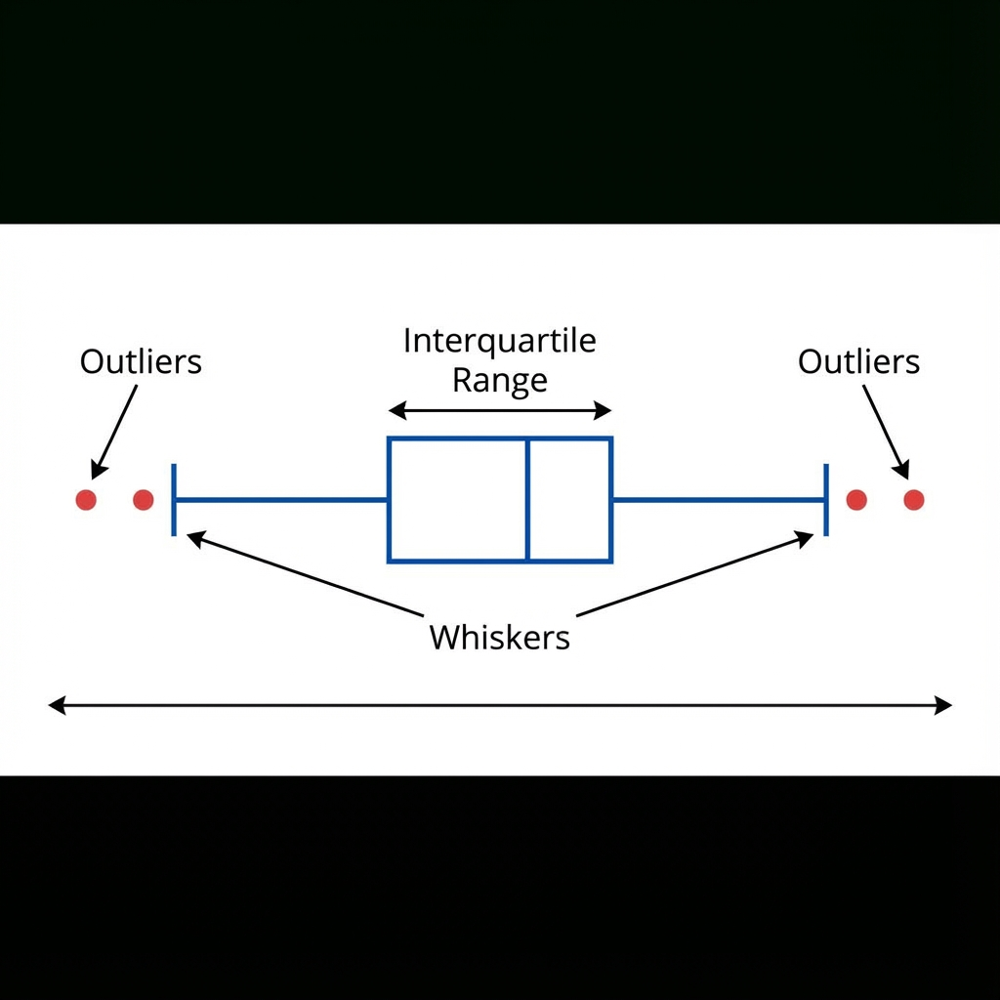

# 🗂️ Research Briefing: California Housing Analysis
*Based on `CaliforniaHousingAnalysis.py` Codebase & Execution Results*

---

## 🏎️ Executive Summary
**The Big Idea**: We assume census data is "clean", but this analysis reveals significant artificial distortions.
**The Solution**: A cleaning pipeline that sacrifices volume (8% data loss) for validity (statistical normality).
**Key Result**: Transforming a raw, skewed dataset into a standardized matrix ready for high-performance Machine Learning.

---

## 🔍 Theme 1: The "Capped Value" Deception
*Why the raw data cannot be trusted blindly.*

> **"The data says lots of houses cost exactly $500,001. That is statistically impossible."**

*   **The Artifact**: A massive spike at the maximum price limit.
*   **The Evidence**: 965 rows (nearly 5%) represent the exact same top-tier price.
*   **The Implication**: The census bureau "clipped" the data.
*   **Why It Matters**: If we train a model on this, it will learn that prices *stop* at $500k. It will fail to predict luxury housing correctly.

---

## 📉 Theme 2: The Scale Imbalance
*Comparing Apples to... entire Orchards.*

**The Conflict**:
*   **Income** is measured in "Tens of Thousands" (Values: 0 to 15).
*   **Population** is measured in "Individual People" (Values: 0 to 35,000).

**The Risk**:
In distance-based algorithms, 'Population' drowns out 'Income'.

**The Fix (StandardScaler)**:
We compress both distributions to a common unit (Z-Score).
*   Result: Democratic Feature Importance where a +1 change means the same thing for both features.

---

## 🛠️ Theme 3: Outlier Strategy (The Surgeon's Knife)
*How we decided what to cut.*

We applied **IQR (Interquartile Range)** filtering.

| Feature | Action | Reasoning |
| :--- | :--- | :--- |
| **AveRooms** | **Removed 511 rows** | Houses with massive outliers (e.g., 50 rooms) are administrative errors. |
| **Population** | **Removed 1196 rows** | Blocks with 35,000 people skew the density metrics. |

*   **Total Loss**: ~1,600 rows.
*   **Net Gain**: A normal distribution that satisfies regression assumptions.

---

## 📊 Deep Dive: Before vs. After
*Visualizing the transformation.*

### ❌ Before Cleaning
*   **Shape**: (20,640, 9)
*   **Distribution**: Heavily right-skewed (long tails).
*   **Reliability**: Low (Extreme outliers drag the mean).

### ✅ After Cleaning & Scaling
*   **Shape**: (18,957, 9)
*   **Distribution**: Gaussian-like (Bell Curves).
*   **Reliability**: High (Mean and Median are aligned).
*   **Ready For**: Linear Regression, Neural Networks, SVM.

---

## 💡 Key Takeaways
1.  **Trust No One**: Even "Standard" datasets like California Housing contain lies (Capped Prices).
2.  **Context is Everything**: A "room count" of 100 is a number, but logically it's an outlier for a single home.
3.  **Scaling is Non-Negotiable**: You cannot mix scales of 10^1 and 10^5 in the same model without normalization.
