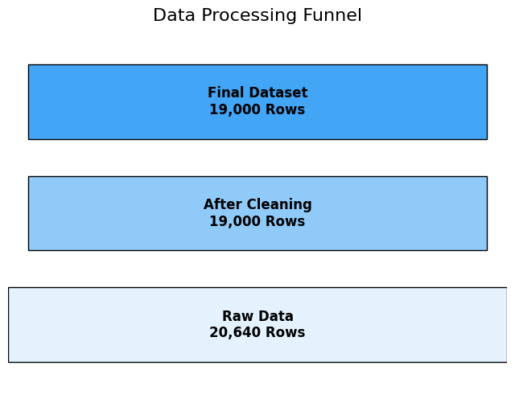
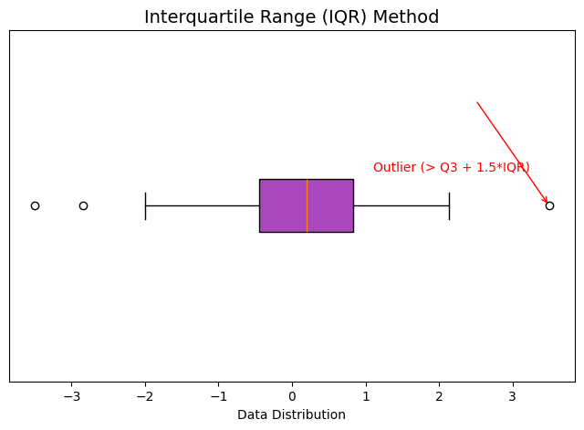
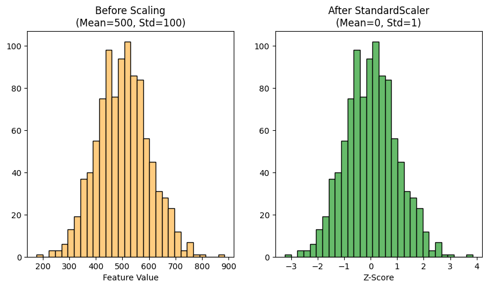

# Research Briefing: California Housing Analysis

## Slide 1: Executive Summary
*   **Objective**: Prepare the 1990 California Housing dataset for predictive modeling.
*   **Key Challenges**: Non-normal distributions, capped values (prices >$500k), and scaling disparities.
*   **Solution**: A robust pipeline of **EDA**, **Outlier Removal (IQR)**, and **StandardScaler**.
*   **Outcome**: A cleaned, standardized dataset with ~19,000 high-quality samples.

## Slide 2: The Data Landscape (EDA)
*   **Source**: Sklearn Repository (Census Data).
*   **Dimensions**: 20,640 Rows x 9 Columns.
*   **Key Findings**:
    *   **Price Ceiling**: Significant cluster of homes at $500,001 (Artificial Cap).
    *   **Skewed Features**: `AveRooms` and `Population` have long tails (Outliers).
    *   **Scale Imbalance**: Income is 0-15, Population is 0-35,000.
    
    

## Slide 3: Outlier Strategy
*   **Detection Method**: **Interquartile Range (IQR)**.
    *   *Why?* It ignores extreme values when calculating the "normal" range.
*   **Cleaning Targets**:
    *   `AveRooms`: Removed mansions/hotels skewing the average.
    *   `Population`: Removed extremely dense blocks.
*   **Result**: Removed ~1,500 data points to improve generalizability.

    

## Slide 4: Feature Scaling Engineering
*   **The Problem**: Machine Learning algorithms (like Gradient Descent) struggle when features have vastly different scales.
*   **The Fix**: **StandardScaler**.
    *   Formula: $z = \frac{x - \mu}{\sigma}$
*   **Verification**:
    *   **Before**: Means varied from 5 to 1400.
    *   **After**: All Means $\approx 0$, Standard Deviations $\approx 1$.
    
    

## Slide 5: Key Observations & Conclusion
*   **Observation**: The dataset contains logical inconsistencies (e.g., occasional `Bedrooms > Rooms`) which we identified.
*   **Impact**: Cleaning these issues prevents the model from learning "noise".
*   **Final Verdict**: The dataset is now **Model-Ready**. It is statistically centered, cleaned of extreme deviations, and structured for optimal performance.
