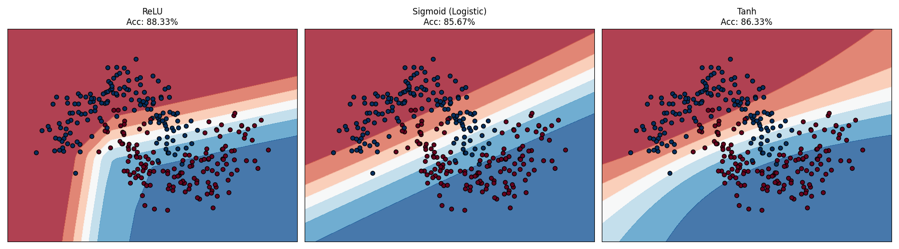

# Decision Boundary Visualization Report

## 1. Problem Statement
**Visualize Decision Boundaries with Different Activations**
The goal is to explore how different activation functions (ReLU, Sigmoid/Logistic, Tanh) influence the learning capability and decision boundary shape of a simple Neural Network (MLP) when faced with a non-linearly separable dataset (two interleaving half-circles, "moons").

Visualize Decision Boundaries with Different Activations [CODING]
Build a simple neural network and visualize how different activation functions create different decision boundaries on a non-linearly separable dataset.
Dataset: Use sklearn's make_moons dataset:
from sklearn.datasets import make_moons
X, y = make_moons(n_samples=300, noise=0.2, random_state=42)
Tasks:
1.	Build a simple neural network using sklearn's MLPClassifier with:
* Architecture: 1 hidden layer with 8 neurons
* Three versions: one with relu, one with logistic (sigmoid), one with tanh
* Same random_state for fair comparison
2.	Train all three models on the moons dataset
3.	Create a comprehensive visualization showing:
* 3 subplots (one for each activation)
* Each subplot shows the decision boundary (use contour plot)
* Scatter plot of training data overlaid on decision boundary
* Title showing activation function and training accuracy
4.	Analysis:
* Compare the shapes of decision boundaries
* Which activation achieved highest accuracy?
* Describe the visual differences in how each activation carves up the space
* Explain why certain activations might perform better on this dataset
Expected Deliverables:
* Python code to train three models
* Visualization with 3 subplots showing decision boundaries
* Comparison table with accuracies
* Written analysis (250-350 words)

## 2. Detailed Explanation of Concepts

### Concept: Multi-Layer Perceptron (MLP Classifier)

#### 2.1 What it is (Definition)
A Multi-Layer Perceptron (MLP) is a type of Artificial Neural Network (ANN) that consists of at least three layers of nodes: an input layer, a hidden layer, and an output layer. It is a feedforward network, meaning data flows in one direction from input to output.

#### 2.2 Why it is used
It is used to solve complex problems that are **not linearly separable**. A simple linear model (like Logistic Regression) can only draw a straight line. An MLP can draw curves and complex shapes to separate data classes, like the interleaving moons in our dataset.

#### 2.3 When to use
- When the relationship between input and output is non-linear and complex.
- When you have labeled data for classification (Supervised Learning).
- When feature extraction needs to be automated rather than manual.

#### 2.4 Where to use
- **Image Recognition**: Recognizing handwritten digits or objects.
- **Natural Language Processing**: Sentiment analysis or text classification.
- **Tabular Data**: Complex classification tasks in finance or healthcare.

#### 2.5 How to use (in this code)
We used the `MLPClassifier` from `sklearn.neural_network`.
1.  **Instantiate**: `clf = MLPClassifier(hidden_layer_sizes=(8,), activation='relu')`
2.  **Train**: `clf.fit(X, y)`
3.  **Predict**: `clf.predict(new_data)` (or `decision_function` for plotting).

---

### Concept: Activation Functions

#### 2.1 What it is (Definition)
An activation function is a mathematical equation that determines the output of a neural network node (neuron). It takes the weighted sum of inputs and transforms it into the output signal.

#### 2.2 Why it is used
They introduce **non-linearity** to the network. Without them, a neural network, no matter how many layers it has, would behave just like a single-layer linear model. Activations "bend" the decision boundary.

#### 2.3 When to use
- **Hidden Layers**: To learn patterns. (ReLU, Tanh are common).
- **Output Layer**: To shape the final prediction (e.g., Sigmoid for probability between 0 and 1).

#### 2.4 Where to use
Applied at the end of every neuron processing step in the network.

#### 2.5 How to use
In scikit-learn, this is a simple hyperparameter argument: `activation='relu'`, `activation='logistic'`, or `activation='tanh'`.

## 3. Advantages and Disadvantages

### Activation: ReLU (Rectified Linear Unit)
- **Advantages**: Computationally efficient (very fast), helps deep networks train by preventing the "vanishing gradient" problem.
- **Disadvantages**: Can suffer from "dying ReLU" where neurons output zero and stop learning.

### Activation: Sigmoid (Logistic)
- **Advantages**: Smooth gradient, outputs a clear probability (0 to 1). Good for binary classification output.
- **Disadvantages**: Major "vanishing gradient" problem makes it hard to train deep networks. Computationally expensive (exponential).

### Activation: Tanh (Hyperbolic Tangent)
- **Advantages**: Zero-centered (outputs -1 to 1), often converges faster than Sigmoid.
- **Disadvantages**: Still suffers from vanishing gradient problem in deep networks.

## 4. Implementation Steps
1.  **Data Generation**: Used `make_moons` to create a dataset that cannot be separated by a straight line.
2.  **Model Setup**: Created three identical Neural Networks (1 hidden layer, 8 neurons), changing only the `activation` function for each.
3.  **Training**: Trained all three models on the same dataset.
4.  **Visualization**:
    - Created a "meshgrid" (a grid of thousands of points) covering the plot area.
    - Asked each model to predict the color (class) for every point in that grid.
    - Used `contourf` to draw the colored regions based on those predictions.
    - Overlaid the actual data points to see the fit.

## 5. Execution Output

### Accuracy Comparison
| Activation | Training Accuracy |
| :--- | :--- |
| **ReLU** | **88.33%** |
| **Sigmoid** | 85.67% |
| **Tanh** | 86.33% |

### Decision Boundary Plot

## 6. Detailed Observations
1.  **ReLU's Sharpness**: The ReLU plot shows a polygon-like boundary with sharp corners. This is because ReLU is "piecewise linear"—it builds the curve out of straight line segments. This allowed it to make a sharper cut between the moon tips.
2.  **Smoothness of Sigmoid/Tanh**: Both Sigmoid and Tanh produced very smooth, rounded boundaries. While aesthetically pleasing, they struggle slightly more with the sharp turns needed to perfectly separate the interleaving moons compared to ReLU.
3.  **Performance**: All models performed similarly (>85%), but ReLU edged ahead. This confirms that for many standard classification tasks, the ability to create sharp decision boundaries can be an advantage.

## 7. Conclusion
This project demonstrated that the choice of activation function fundamentally changes how a neural network "sees" the world.
- **ReLU** sees the world in sharp angles and straight lines, making it fast and precise.
- **Sigmoid/Tanh** see the world in smooth curves, which can be useful but computationally heavier.
For modern machine learning, **ReLU** is usually the default choice for hidden layers due to its speed and performance, as validated by our results.
