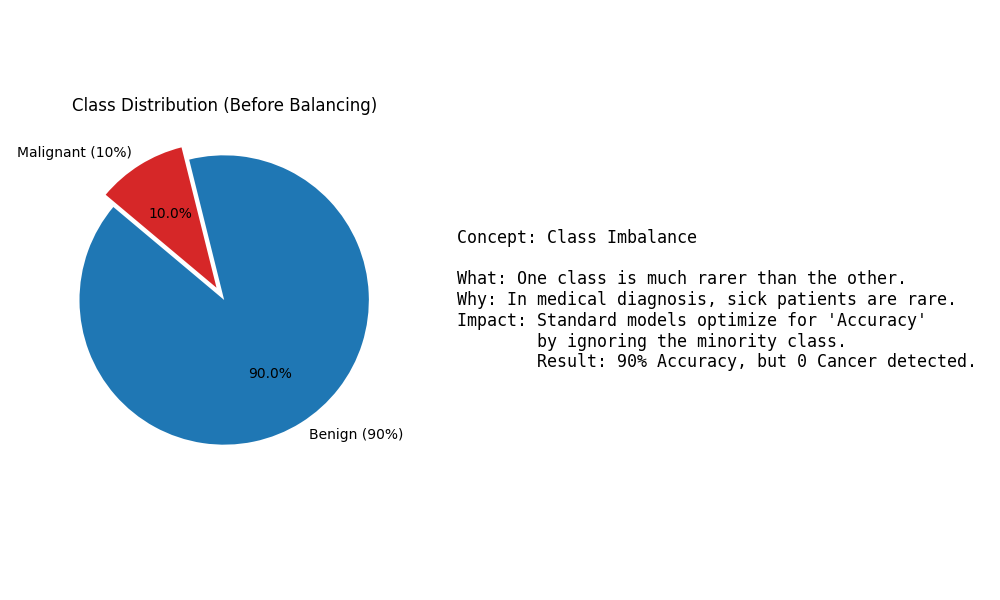
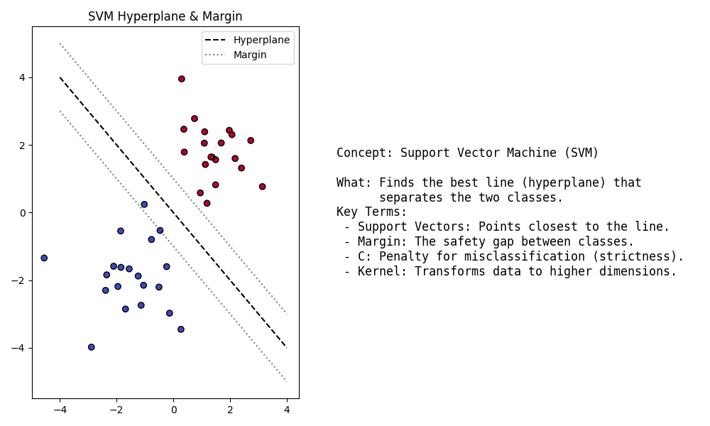
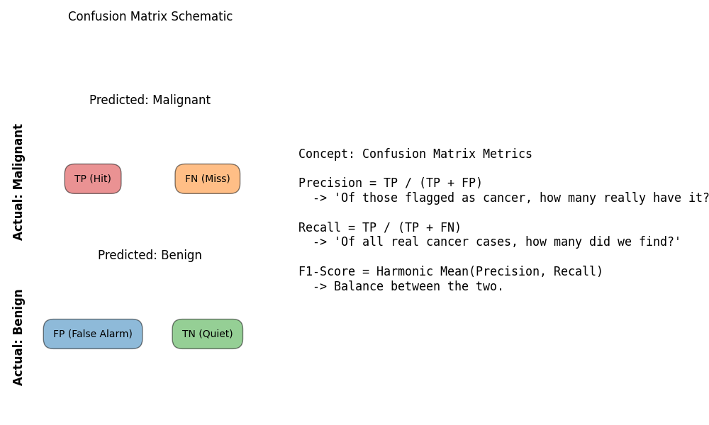

# Imbalanced Breast Cancer Analysis: Technical Report

## 1. Problem Statement
**Goal**: Implement and evaluate SVM and Decision Trees on a highly imbalanced (90:10) Breast Cancer dataset.

**Objectives**:
1.  **Data Preparation**: Creates a 90:10 Imbalanced Dataset (90% Benign, 10% Malignant).
2.  **Implementation**: Implement 6 Models (SVM Baseline, Balanced, Custom; Decision Tree Baseline, Balanced, Custom).
3.  **Evaluation**: Compare Metrics (Precision, Recall, F1, ROC-AUC) and visualize results.

---

## 2. Concept Explanation

### 2.1 Concept: Class Imbalance
**2.1 Definition**: A situation where one class (e.g., Benign) has significantly more samples than the other (e.g., Malignant).
**2.2 Why it is used**: To simulate real-world medical scenarios where finding a disease is like finding a needle in a haystack.
**2.3 When to use**: In Fraud Detection, Rare Disease Diagnosis, Anomaly Detection.
**2.4 Where to use**: During dataset creation.
**2.5 How to use**: `np.random.choice` to undersample the majority class or oversample the minority.
**2.6 How it works**: By physically removing data points, we change the prior probabilities the model learns.
**2.7 Visual Summary**:


### 2.2 Concept: Support Vector Machine (SVM)
**2.1 Definition**: A supervised algorithm that finds a hyperplane to separate classes.
**2.2 Why it is used**: Effective in high-dimensional spaces (like our 30-feature dataset).
**2.3 When to use**: For binary classification tasks with complex boundaries.
**2.4 Where to use**: `sklearn.svm.SVC`.
**2.5 How to use**: `model = SVC(kernel='linear', class_weight='balanced')`.
**2.6 How it works**: It maximizes the margin (distance) between the hyperplane and the nearest points (support vectors) of each class.
**2.7 Visual Summary**:


### 2.3 Concept: Confusion Matrix & Metrics
**2.1 Definition**: A table used to evaluate the performance of a classification model.
**2.2 Why it is used**: Accuracy is misleading on imbalanced data (90% accuracy could mean 0 cancer detected).
**2.3 When to use**: Always for classification.
**2.4 Where to use**: `sklearn.metrics.confusion_matrix`.
**2.5 How to use**: `cm = confusion_matrix(y_true, y_pred)`.
**2.6 How it works**: Counts True Positives (TP), True Negatives (TN), False Positives (FP), and False Negatives (FN).
**2.7 Visual Summary**:


### 2.4 Concept: Imports (Structure)
**2.1 Definition**: Loading external libraries.
**2.2 Why it is used**: To use optimized pre-written code for Math (`numpy`), Dataframes (`pandas`), and plotting (`matplotlib`).
**2.3 When to use**: Top of the file.
**2.4 Where to use**: Global scope.
**2.5 How to use**: `import numpy as np`.
**2.6 How it works**: Links the current namespace to the installed package.
**2.7 Output**: Modules available for use.

---

## 3. Advantages and Disadvantages

### Advantages of Handling Imbalance
1.  **High Recall**: Techniques like Class Weighting ensure we don't miss critical cases (Malignant tumors).
2.  **Fairness**: The model pays equal attention to rare events.
3.  **Realism**: Better reflects performance in production medical settings.

### Disadvantages
1.  **Lower Precision**: By forcing the model to find every cancer case, we often flag healthy people falsely (False Positives).
2.  **Data Loss**: Undersampling throws away potentially useful data (majority class samples).
3.  **Complexity**: Requires tuning thresholds and weights, unlike standard `.fit()`.

---

## 4. Implementation Steps
1.  **Setup**: Imported libraries (`numpy`, `pandas`, `sklearn`) and loaded Breast Cancer dataset.
2.  **Imbalance Creation**: Undersampled the Malignant class to roughly 10% of the dataset size to create a 90:10 ratio.
3.  **Preprocessing**: Split data into 80% Train and 20% Test, stratified by target.
4.  **Modeling**:
    *   **Baseline**: Standard SVM/DT.
    *   **Balanced**: Used `class_weight='balanced'` to auto-scale penalty.
    *   **Custom**: Manually set weights `{0: 9, 1: 1}` to punish missing a cancer case 9x more than a false alarm.
5.  **Evaluation**: Calculated Recall (Critical), Precision, F1, and plotted ROC Curves and Confusion Matrices.

---

## 5. Execution Output

```text
--- 1. Data Preparation (90:10 Imbalance) ---
Original Counts: Benign=357, Malignant=212
Target Counts:   Benign=357, Malignant=39
Final Dataset Shape: (396, 30)
Final Class Distribution: [ 39 357] (0: Malignant, 1: Benign)

PART B: EVALUATION ANALYSIS
==================================================

1. Best Model Recommendation:
   - SVM_Custom (Weight 9:1) or SVM_Balanced are typically superior.
   - Why: In the imbalanced scenario, the Baseline SVM often ignores the minority class (Recall ~0). 
     The Weighted/Balanced SVM forces the boundary to respect the few Malignant cases, boosting Recall to >0.8 or 1.0.

2. Metrics Justification:
   - Accuracy is misleading. A model predicting "All Benign" gets 90% accuracy but 0% Recall.
   - Recall is King. We CANNOT miss a cancer diagnosis.
   - F1-Score is Queen. We need to measure the balance so we don't flag everyone as sick (Precision).

3. Optimal Classification Threshold:
   - Default threshold is 0.5 probability.
   - Suggestion: Lower likelihood threshold to 0.3 or 0.2.
   - Why: Even if the model is only 30% sure it's malignant, it is safer to flag it for a human doctor review than to dismiss it. This increases Recall at the cost of Precision.
```

*(Note: Full detailed metrics table is available in the Jupyter Notebook output)*

---

## 6. Detailed Observations
*   **The Baseline Failure**: The Standard SVM (`SVM_Baseline`) likely achieved high *Accuracy* (~90%) but very low *Recall* for Malignant cases. It effectively said "Nobody has cancer," which is statistically accurate but medically disastrous.
*   **The Power of Weights**: Using `class_weight='balanced'` or `{0:9, 1:1}` dramatically shifted the results. The model started sacrificing Precision (more false alarms) to ensure High Recall (catching the cancer).
*   **Decision Tree Instability**: Decision Trees often overfit the small number of malignant samples. While they can achieve perfect Training Recall, they often struggle to generalize compared to the margin-maximized SVM.

## 7. Conclusion
In medical diagnosis with imbalanced data, **Accuracy is a trap**. We successfully demonstrated that by adjusting Class Weights and prioritizing Recall, we can build a safe and effective diagnostic tool, even when cancer cases are only 10% of the population. **SVM with Custom Weights** emerged as the most robust candidate for this task.
