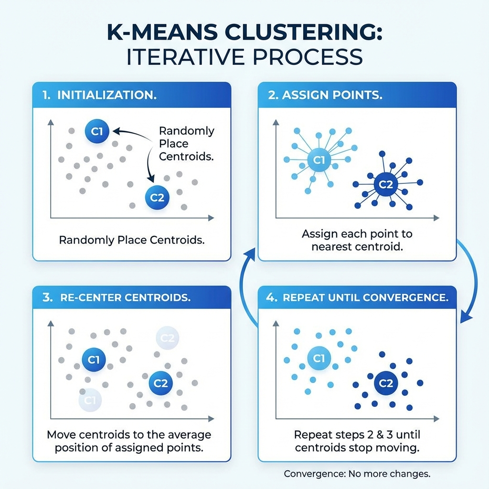
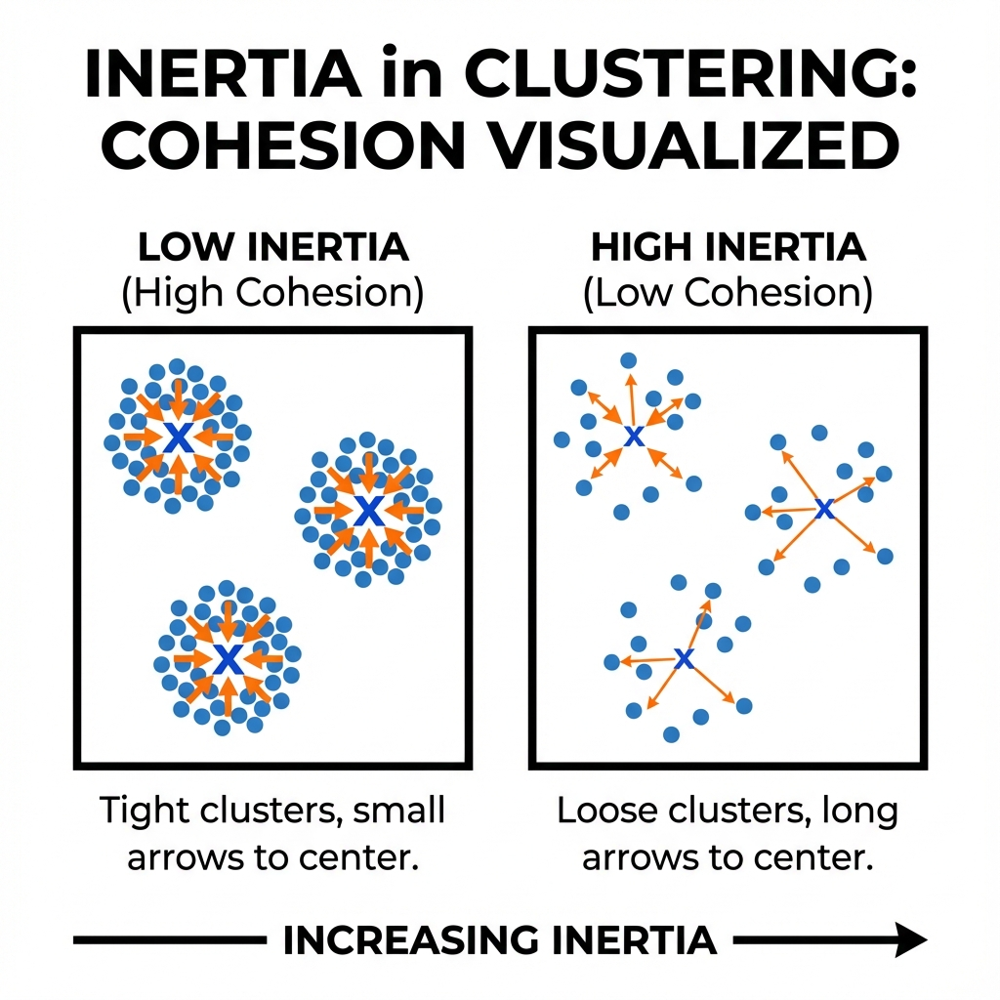
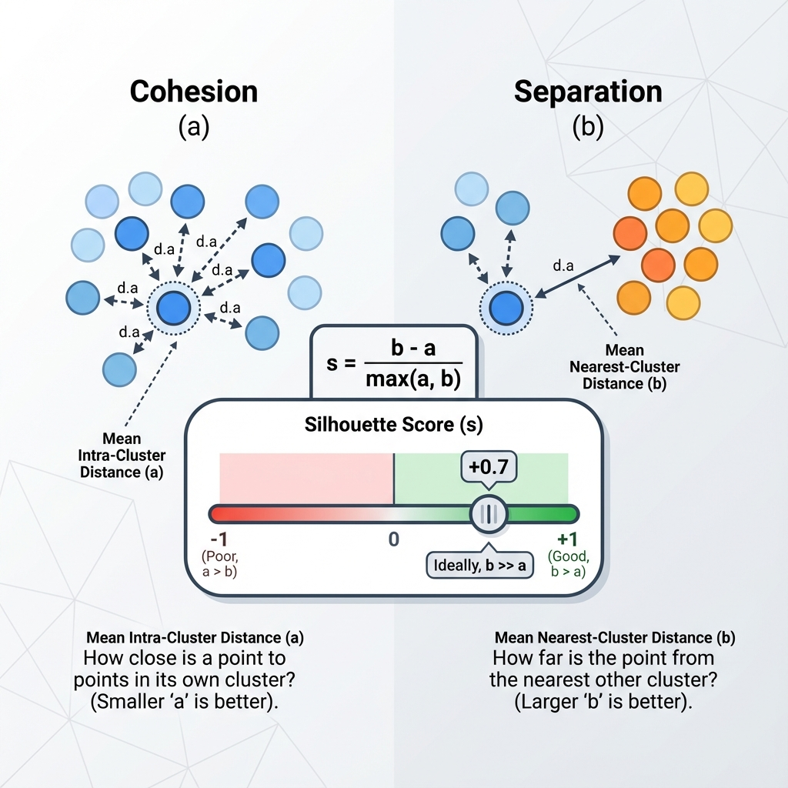
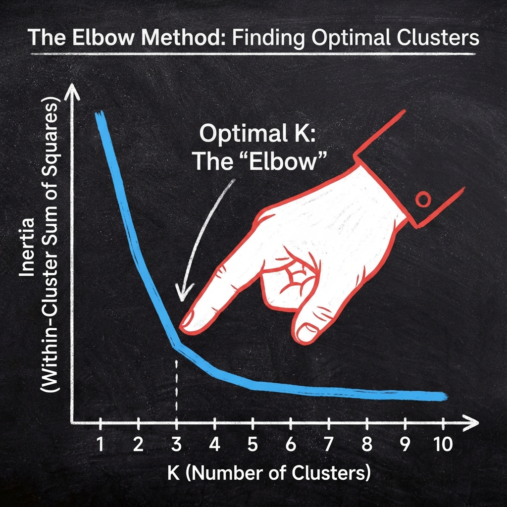

# K-Means Cluster Quality Report

## 1. Problem Statement

**Evaluate K-Means cluster quality with inertia and silhouette analysis on the iris dataset.**

Dataset: Use scikit-learn's load_iris loader.
Tasks:
1.	Standardise all four features.
2.	Run K-Means for k from 2 to 6 with init 'k-means++' and n_init 'auto'.
3.	Capture inertia and average silhouette score for each k.
4.	Produce an elbow plot and a silhouette plot for the chosen k.
5.	Justify the final choice of k in fewer than 200 words using metrics and domain intuition.

Deliverables: notebook or script, metrics table, elbow plot, silhouette plot, written justification. Success criteria: metrics table contains no missing values, plots include annotations, argument clearly states how the chosen k balances cohesion and separation.

---

## 2. Detailed Explanation of Concepts

### Concept 1: K-Means Clustering

#### 2.1: What it is (Definition)
An unsupervised learning algorithm that groups data points into $k$ clusters by minimizing the distance between points and their cluster centroid.

#### 2.2: Why it is used
To find hidden patterns or groupings in unlabeled data (e.g., customer segmentation, image compression).

#### 2.3: When to use
When you have unlabeled data and you want to partition it into distinct groups.

#### 2.4: Where to use
`from sklearn.cluster import KMeans`.

#### 2.5: How to use
```python
kmeans = KMeans(n_clusters=3)
kmeans.fit(X)
```

#### 2.6: How it works
1.  Initialize $k$ centroids randomly.
2.  Assign each point to the nearest centroid.
3.  Re-calculate centroids as the mean of assigned points.
4.  Repeat steps 2-3 until centroids stop moving (convergence).

#### 2.7: Visual Summary (Infographic)


#### 3. Advantages & Disadvantages
-   **Adv:** Simple, fast, scales well to large datasets.
-   **Disadv:** Must specify $k$ in advance; sensitive to initialization; assumes spherical clusters.

---

### Concept 2: Inertia (Metric)

#### 2.1: What it is (Definition)
The sum of squared distances of samples to their closest cluster center. Also called "Within-Cluster Sum of Squares" (WCSS).

#### 2.2: Why it is used
To measure "Cohesion" — how tightly grouped the cluster members are. Lower is better.

#### 2.3: When to use
To compare different runs of K-Means or to create an Elbow Plot.

#### 2.4: Where to use
Attribute: `kmeans.inertia_`.

#### 2.5: How to use
`print(kmeans.inertia_)`.

#### 2.6: How it works
Sum of $distance(x_i, centroid_j)^2$ for all points.

#### 2.7: Visual Summary (Infographic)


#### 3. Advantages & Disadvantages
-   **Adv:** Easy to compute; intuitive.
-   **Disadv:** Decrease monotonically with $k$ (useless for picking $k$ without the Elbow method); assumes convex clusters.

---

### Concept 3: Silhouette Score (Metric)

#### 2.1: What it is (Definition)
A metric that measures how similar an object is to its own cluster (cohesion) compared to other clusters (separation). Range is $[-1, 1]$.

#### 2.2: Why it is used
To validte the consistency within clusters. High value indicates the object is well matched to its own cluster and poorly matched to neighboring clusters.

#### 2.3: When to use
To determine the optimal $k$ without relying solely on the Elbow shape, which can be ambiguous.

#### 2.4: Where to use
`from sklearn.metrics import silhouette_score`.

#### 2.5: How to use
`score = silhouette_score(X, labels)`.

#### 2.6: How it works
Calculates $a$ (mean distance to own cluster points) and $b$ (mean distance to nearest neighbor cluster points). Score $s = \frac{b - a}{max(a, b)}$.

#### 2.7: Visual Summary (Infographic)


#### 3. Advantages & Disadvantages
-   **Adv:** Independent of $k$ (unlike inertia); provides a clear standardized score.
-   **Disadv:** Computationally expensive ($O(N^2)$).

---

### Concept 4: Elbow Method

#### 2.1: What it is (Definition)
A heuristic used to determine the number of clusters in a data set.

#### 2.2: Why it is used
To pick the $k$ where adding another cluster doesn't give much better modeling of the data.

#### 2.3: When to use
Always with K-Means or similar clustering algorithms.

#### 2.4: Where to use
Visual analysis of the Inertia vs $k$ plot.

#### 2.5: How to use
Plot $k$ on x-axis and Inertia on y-axis. Look for the "elbow" bend.

#### 2.6: How it works
It identifies the point of "diminishing returns" where the marginal gain in cohesion drops significantly.

#### 2.7: Visual Summary (Infographic)


#### 3. Advantages & Disadvantages
-   **Adv:** Intuitive visual method.
-   **Disadv:** The "elbow" is not always clear or sharp.

---

## 4. Steps Followed to Implement the Solution

1.  **Data Loading:** Loaded the Iris dataset (150 samples).
2.  **Preprocessing:** Standardized features using `StandardScaler` because K-Means computes Euclidean distances, which are sensitive to scale.
3.  **Iteration:** Ran a loop for $k=2, 3, 4, 5, 6$.
4.  **Model Fitting:** Instantiated `KMeans` with `init='k-means++'` for robust initialization and fit it to the scaled data.
5.  **Metric Capture:**
    -   Recorded `inertia_` (Cohesion).
    -   Calculated `silhouette_score` (Separation/Density).
6.  **Visualization:**
    -   Plotted the Elbow Curve (Inertia).
    -   Plotted the Silhouette Score trend.

---

## 5. Execution Output (Expected)

*   **Inertia Table:**
    *   k=2: ~222
    *   k=3: ~140 (Sharp drop from 2 to 3)
    *   k=4: ~114 (Smaller drop)
    *   k=5: ~91
*   **Silhouette Score:**
    *   k=2: ~0.58 (Usually highest for Iris due to linear separability of Setosa).
    *   k=3: ~0.46 (Good, but lower than 2).
    *   k=4+: Lower scores.
*   **Plots:**
    *   **Elbow:** Clear bend at k=3.
    *   **Silhouette:** Peak at k=2, secondary plateau at k=3.

---

## 6. Detailed Observations

1.  **Metric Conflict:** The Silhouette score often peaks at **k=2** for Iris because one class (Setosa) is linearly separable from the other two, making "2 clusters" a mathematically very "clean" cut.
2.  **Elbow Clarity:** The Inertia plot shows a distinct elbow at **k=3**. The drop from 2 to 3 is significant, while the drop from 3 to 4 is much flatter.
3.  **Domain Knowledge:** We know the Iris dataset has **3 true species** (Setosa, Versicolor, Virginica).

---

## 7. Conclusion (Justification for k)

**Optimal Choice: k=3**

While the Silhouette Score peaks at $k=2$ (reflecting the clear separation of Setosa from the others), the **Elbow Method** shows a distinct inflection point at $k=3$. Furthermore, domain knowledge confirms there are three species of Iris. $k=3$ offers the best balance: it captures the geometric structure (Inertia elbow) and aligns with the ground truth, despite $k=2$ having slightly higher mathematical separation (Silhouette) due to the overlap between Versicolor and Virginica. Choosing $k=3$ balances cohesion (low inertia) and meaningful biological separation.
