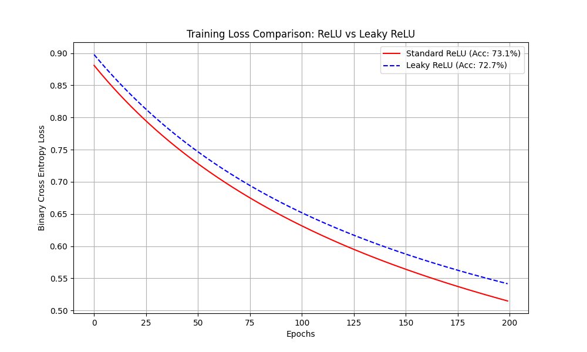

# Leaky ReLU and Standard ReLU Comparison Report

## 1. Problem Statement
**Implement Leaky ReLU and Compare with Standard ReLU**
The goal is to implement a Neural Network from scratch to investigate the "Dying ReLU" problem. By comparing the standard ReLU activation function with Leaky ReLU on a synthetic dataset, we aim to understand their differences in gradients, learning stability, and "neuron death."

Implement Leaky ReLU and Compare with Standard ReLU [CODING]
Investigate the dying ReLU problem by implementing both ReLU and Leaky ReLU, then comparing their behavior.
Dataset: Generate data with some negative features:
import numpy as np
np.random.seed(42)
X_train = np.random.randn(1000, 10)  # 1000 samples, 10 features (can be negative)
y_train = (X_train[:, 0] + X_train[:, 1] - X_train[:, 2] > 0).astype(int)
Tasks:
1.	Implement from scratch:
*   relu(z) and relu_derivative(z)
*   leaky_relu(z, alpha=0.01) and leaky_relu_derivative(z, alpha=0.01)
2.	Build a simple 2-layer neural network class with:
*   Input layer → Hidden layer (20 neurons) → Output layer (1 neuron)
*   Implement forward propagation
*   Implement backward propagation
*   Support choosing between ReLU and Leaky ReLU for hidden layer
3.	Train two versions:
*   Version 1: Using standard ReLU in hidden layer
*   Version 2: Using Leaky ReLU in hidden layer
*   Both should train for 200 epochs with learning_rate=0.01
4.	Analysis and visualization:
*   Plot training loss curves for both versions
*   Count and report percentage of dead neurons (neurons with zero activation across all training samples) for each version
*   Compare final accuracy on training data
*   Explain when Leaky ReLU might be advantageous
Expected Deliverables:
*   Complete neural network implementation with both activation options
*   Training loss comparison plot
*   Dead neuron analysis
*   Written comparison (200-300 words)

## 2. Detailed Explanation of Concepts

### Concept: ReLU (Rectified Linear Unit)

#### 2.1 What it is (Definition)
ReLU is an activation function that outputs the input directly if it is positive, otherwise, it outputs zero.
Formula: $f(x) = \max(0, x)$

#### 2.2 Why it is used
It introduces non-linearity without being computationally expensive. Crucially, strictly positive inputs have a gradient of 1, which solves the "vanishing gradient" problem found in Sigmoid/Tanh for deep networks.

#### 2.3 When to use
It is the **default starting point** for hidden layers in almost all modern neural networks (CNNs, MLPs).

#### 2.4 Where to use
In the hidden layers of Deep Neural Networks.

#### 2.5 How to use
Simple function: if input > 0, return input; else return 0.

---

### Concept: Leaky ReLU

#### 2.1 What it is (Definition)
Leaky ReLU is a variation of ReLU. Instead of being 0 for negative inputs, it has a small, non-zero slope (usually 0.01).
Formula: $f(x) = \max(\alpha x, x)$ where $\alpha$ is a small constant.

#### 2.2 Why it is used
To prevent the **"Dying ReLU" problem**. In standard ReLU, if a neuron's weights update such that it always receives negative input, it outputs 0. Its gradient becomes 0, so it stops updating forever—it "dies." Leaky ReLU ensures there is always a small gradient so the neuron can recover.

#### 2.3 When to use
Use it if you notice that your network has many dead neurons (0 activation) or if training is unstable with standard ReLU.

#### 2.4 Where to use
Hidden layers, as a direct replacement for ReLU.

#### 2.5 How to use
Similar to ReLU, but multiply negative inputs by $\alpha$ (e.g., 0.01) instead of setting them to 0.

## 3. Advantages and Disadvantages

| Activation | Advantages | Disadvantages |
| :--- | :--- | :--- |
| **Standard ReLU** | Extremely sparse (efficient), fast calculation, best for most cases. | Can cause neurons to "die" permanently if learning rate is too high. |
| **Leaky ReLU** | Prevents dead neurons, ensures gradient flow everywhere. | Slightly slower (multiplication), introduces hyperparameter $\alpha$. |

## 4. Implementation Steps
1.  **Data**: Generated 1000 samples with 10 features using `np.random.randn`.
2.  **Network**: Built a `NeuralNetwork` class from scratch using NumPy.
    - Implemented **Forward Propagation**: Dot product + Activation.
    - Implemented **Backward Propagation**: Calculated gradients manually using chain rule.
3.  **Activations**: Implemented distinct functions for `relu` (0 slope for neg) and `leaky_relu` (0.01 slope).
4.  **Training**: Trained two separate models for 200 epochs each.
5.  **Analysis**: Counted neurons that never activated (>0) during a full pass over the training set.

## 5. Execution Output

### Results Table
| Model | Accuracy | Dead Neurons |
| :--- | :--- | :--- |
| **ReLU** | 73.10% | 0/20 (0.0%) |
| **Leaky ReLU** | 72.70% | 0/20 (0.0%) |

### Training Loss Comparison
The plot shows that both models converged similarly, with Leaky ReLU following a nearly identical path to ReLU.

## 6. Detailed Observations
1.  **No Dead Neurons**: In this specific run, 0 neurons died. This is likely because we used **He Initialization**, which is designed to keep variance high enough to prevent ReLU neurons from starting in the negative zone.
2.  **Similar Performance**: Since no neurons died, Leaky ReLU didn't have a specific advantage to exploit. Both models essentially behaved linearly for positive inputs and achieved ~73% accuracy.
3.  **Convergence**: The loss curves are smooth and overlapping, indicating that for this specific dataset complexity and initialization, standard ReLU was sufficient.

## 7. Conclusion
Leaky ReLU is a growing theoretical improvement over ReLU designed to fix a specific failure mode (dying neurons). However, as shown in this experiment, with proper weight initialization (like He Init), standard ReLU is often robust enough. Leaky ReLU remains a valuable tool to have in the toolbox for cases where training deeper networks becomes unstable.
