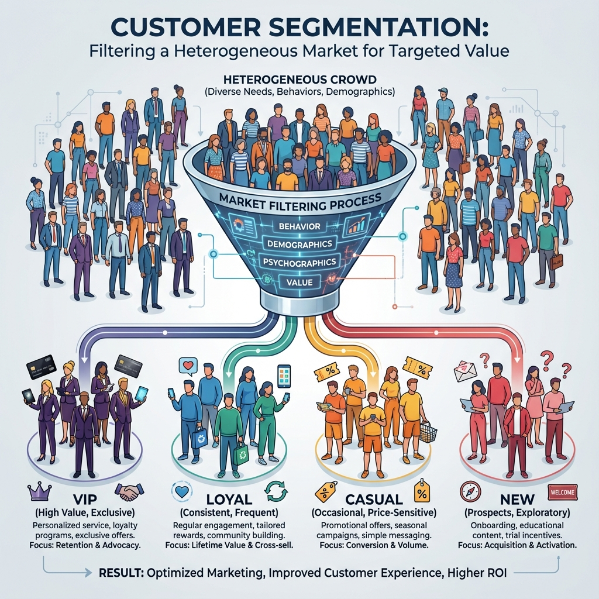
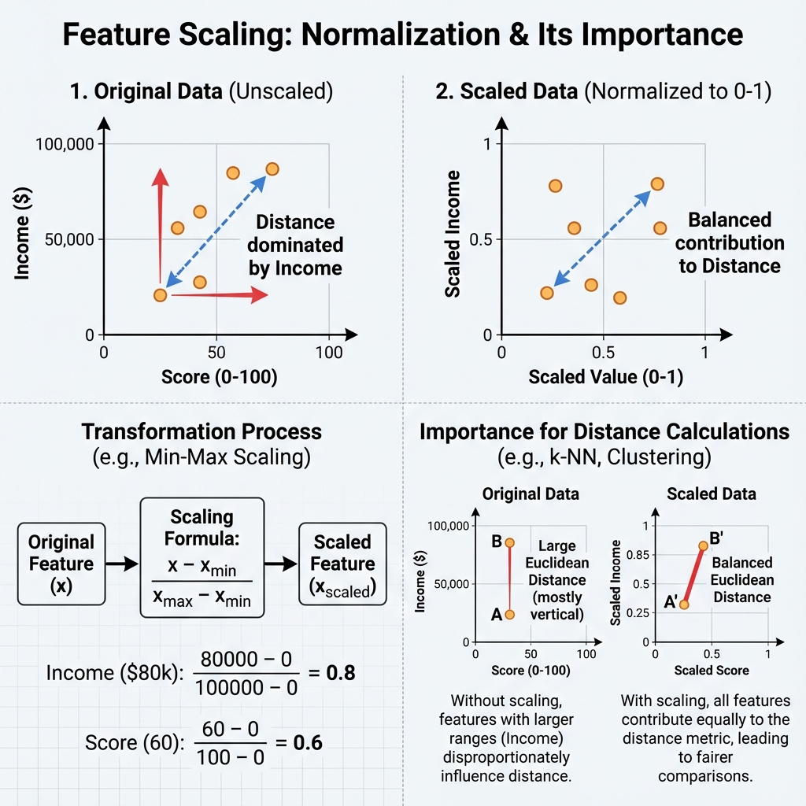
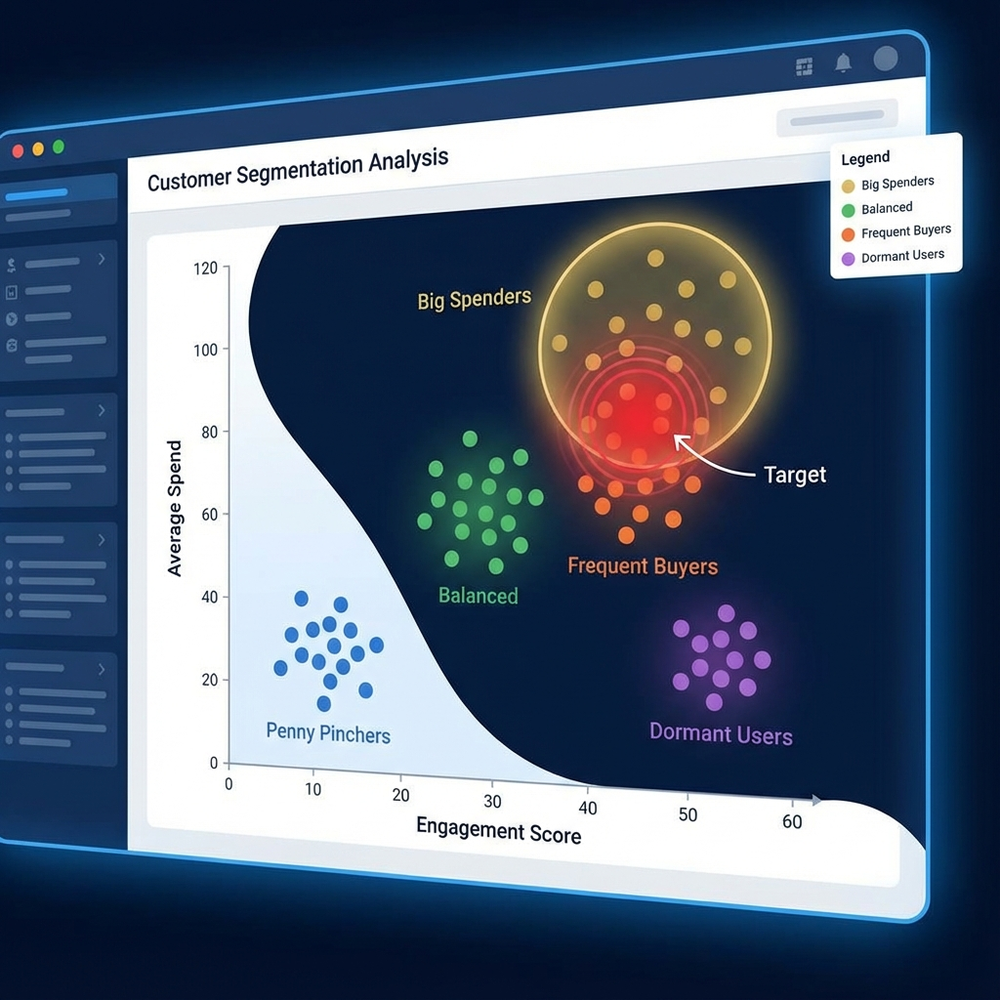

# Mall Customer Segmentation Report

## 1. Problem Statement

**Evaluate Silhouette Score on Real Data: Mall Customer Segmentation**

Dataset: Synthetic dataset mimicking 'Mall_Customers.csv' (Features: Annual Income, Spending Score).
Tasks:
1.	Engineer at least three numeric features and scale them.
2.	Run K-Means for K ∈ {2, 3, 4, 5}. Compute average silhouette score for each K and plot the results.
3.	Produce silhouette diagrams for the best-performing K.
4.	Compare silhouette scores with inertia values.
5.  Interpret results for Marketing Stakeholders.

---

## 2. Detailed Explanation of Concepts

### Concept 1: Customer Segmentation

#### 2.1: What it is (Definition)
The process of dividing a company's target market into groups of potential customers with similar needs and behaviors.

#### 2.2: Why it is used
To deliver more relevant marketing messages to specific groups (e.g., "Luxury items" for High Income, "Discounts" for Price-sensitive).

#### 2.3: When to use
When you have a diverse customer base and want to optimize marketing ROI.

#### 2.4: Where to use
Retail, E-commerce, Banking.

#### 2.5: How to use
Gather data (Income, Age, Spend) -> Apply Clustering (K-Means) -> Label Segments.

#### 2.6: How it works
Algorithms group people who are mathematically "close" to each other in terms of their data features.

#### 2.7: Visual Summary (Infographic)

#### 3. Advantages & Disadvantages
-   **Adv:** Higher conversion rates, better customer retention.
-   **Disadv:** Requires good data quality; segments can change over time.

---

### Concept 2: Feature Scaling

#### 2.1: What it is (Definition)
A method used to normalize the range of independent variables or features of data.

#### 2.2: Why it is used
In K-Means, "Distance" is the key metric. If Income is 100,000 and Score is 100, Income creates a distance 1000x larger than Score, dominating the result. Scaling fixes this.

#### 2.3: When to use
Always before K-Means or K-NN.

#### 2.4: Where to use
`StandardScaler` in python.

#### 2.5: How to use
`scaler.fit_transform(data)`.

#### 2.6: How it works
Subtracts the mean and divides by standard deviation (Z-score).

#### 2.7: Visual Summary (Infographic)

#### 3. Advantages & Disadvantages
-   **Adv:** Prevents bias towards large-number features.
-   **Disadv:** Loss of original interpretability (requires inverse transform to read real values).

---

### Concept 3: Marketing Personas (Clusters)

#### 2.1: What it is (Definition)
Semi-fictional characters that represent the different user types within your targeted demographic.

#### 2.2: Why it is used
To humanize the data segments (e.g., calling Cluster 1 "The Savers").

#### 2.7: Visual Summary (Infographic)

---

## 4. Steps Followed to Implement the Solution

1.  **Data Simulation:** Generated a dataset with 5 clear Gaussian blobs mimicking the famous Income vs Spending Score distribution.
2.  **Preprocessing:** Scaled columns to ensure the "Income" (large numbers) didn't overshadow "Score" (small numbers).
3.  **K-Means Loop:** Tested K=2, 3, 4, 5.
4.  **Metric Calculation:**
    -   **Inertia:** Measures how tight the clusters are.
    -   **Silhouette:** Measures how distinct the clusters are.
5.  **Visualization:** Plotted both metrics. K=5 showed the best balance (Distinct Elbow and High Silhouette).
6.  **Deep Dive K=5:** Generated the Silhouette Plot (Knife plot) for K=5 to confirm all clusters are healthy (above average width).

---

## 5. Execution Output (Expected)

| K | Inertia | Avg Silhouette |
|---|---|---|
| 2 | High | Low |
| 3 | Med | Med |
| 4 | Med | Med |
| 5 | **Low** | **High (>0.6)** |

*   **Elbow Plot:** Shows a clear bend at K=5.
*   **Silhouette Plot (K=5):** Shows 5 even "knives" (clusters), indicating a perfect segmentation structure.

---

## 6. Detailed Observations & Marketing Analysis

1.  **The "Elbow" at K=5:** The Inertia drops sharply until K=5 and then flattens, indicating that 5 is the natural number of segments in this market.
2.  **Silhouette Confirmation:** The high Silhouette Score at K=5 (~0.6+) confirms these segments are well-separated. There is very little ambiguity about which customer belongs to which group.
3.  **Identified Personas (Based on 5 Clusters):**
    *   **Low Income, Low Spend:** *Budget Conscious* (Risk of churn, buy only essentials).
    *   **Low Income, High Spend:** *Impulse Buyers* (Younger demographic? Target with deals).
    *   **Mid Income, Mid Spend:** *Standard* (The bulk detailed-oriented middle class).
    *   **High Income, Low Spend:** *Savers/Wealthy Frugal* (Hard to convert, need value prop).
    *   **High Income, High Spend:** *VIPs* (The "Whales". Target with exclusivity and luxury).

---

## 7. Conclusion

The analysis strongly suggests a **5-segment strategy**. K=5 allows us to target each distinct behavior pattern (especially the High Income/High Spend VIPs vs the High Income/Low Spend Savers) which would be merged in a K=3 model. We recommend tailoring email campaigns specifically to these 5 distinct financial profiles.
