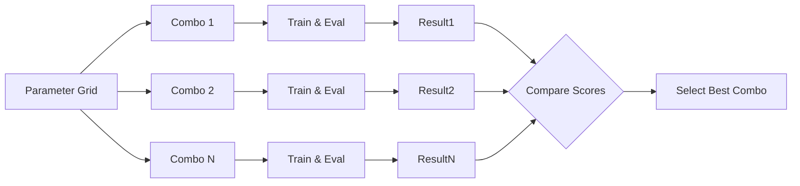

# Nested Cross-Validation Analysis Report

## 1. Problem Statement

**Nested CV compute + honest estimation**: You have a dataset of 12,000 samples and plan to estimate performance using nested cross-validation. The outer loop uses 5 folds. Inside each outer-training split, you run an inner 4-fold CV grid search over 18 hyperparameter combinations. You train 1 model per fold per hyperparameter combo. Each training run takes 7 minutes on your GPU. Additionally, after selecting the best hyperparameters for each outer fold, you retrain once on the full outer-training split (so 1 extra training run per outer fold) which takes 10 minutes each.

**(a) Compute the total number of training runs.**
**(b) Compute total training time in hours.**
**(c) If you reduce the grid from 18 to 10 combinations, recompute (a) and (b) and report the % time saved.**

---

## 2. Concept Explanation

Since the implemented solution is a pure calculation script, we did not use external libraries. However, to understand the *context* of the problem, we explain the core concepts of **Nested Cross-Validation** and **Grid Search**, which are standard in machine learning workflows (typically implemented via `scikit-learn`).

### 2.1 Nested Cross-Validation

#### 2.1.1 Definition
Nested Cross-Validation is a technique to estimate the generalization error of the underlying model and its hyperparameter search procedure. It involves two loops: an *outer* loop for error estimation and an *inner* loop for hyperparameter tuning.

#### 2.1.2 Why it is used
It prevents **data leakage** (specifically, overfitting to the validation set) during hyperparameter tuning. If you use the same data to select hyperparameters and evaluate performance, your results will be optimistically biased.

#### 2.1.3 When to use
Use it when you need a robust, unbiased estimate of how well your model (and your tuning process) will perform on unseen data, especially when the dataset is small to medium-sized.

#### 2.1.4 Where to use
In the model evaluation phase of a machine learning project, before the final model deployment.

#### 2.1.5 How to use
- **Outer Loop**: Split data into $K_{outer}$ folds. For each fold, hold out a test set.
- **Inner Loop**: On the training set of the outer fold, perform another $K_{inner}$-fold CV to find the best hyperparameters.
- **Refit**: Train on the full outer training set using the best hyperparameters found.
- **Evaluate**: Test on the outer hold-out set.

#### 2.1.6 How it works
It effectively simulates the entire model training and selection process $K_{outer}$ times on different subsets of data.

#### 2.1.7 Visual Summary
```mermaid
graph TD
    Data[Full Dataset] --> Split[Split into K Outer Folds]
    Split --> OuterLoop{Outer Loop k=1..5}
    OuterLoop --> TrainSet[Outer Train Set]
    OuterLoop --> TestSet[Outer Test Set]
    TrainSet --> InnerCV[Inner CV (Grid Search)]
    InnerCV -- 4 Folds, 18 Params --> BestParams[Find Best Hparams]
    BestParams --> Refit[Refit on Outer Train]
    Refit --> FinalModel[Fold Model]
    FinalModel --> Evaluate[Evaluate on Test Set]
    Evaluate --> Score[Performance Score]
    
    style InnerCV fill:#f9f,stroke:#333,stroke-width:2px
    style Refit fill:#bbf,stroke:#333,stroke-width:2px
```

### 2.2 Grid Search

#### 2.2.1 Definition
Grid Search is an exhaustive search method for hyperparameter optimization where you specify a set of values for each parameter, and the algorithm evaluates the model for every combination.

#### 2.2.2 Why it is used
To find the optimal combination of hyperparameters that minimizes the error metric.

#### 2.2.3 When to use
When the hyperparameter space is small enough that brute-force evaluation is computationally feasible.

#### 2.2.4 Where to use
Inside the inner loop of a Nested CV or as a standalone tuning step.

#### 2.2.5 How to use
Define a dictionary of parameters (e.g., `{'C': [1, 10], 'kernel': ['linear', 'rbf']}`) and iterate through the Cartesian product.

#### 2.2.6 How it works
It trains and evaluates a model for every single point in the grid. If you have 2 parameters with 3 options each, it runs $3 \times 3 = 9$ experiments.

#### 2.2.7 Visual Summary


---

## 3. Advantages and Disadvantages

### Nested Cross-Validation
**Advantages:**
- **Unbiased Estimate**: Provides a more accurate estimate of generalization error than non-nested CV (flat CV).
- **Robustness**: Reduces the risk of overfitting hyperparameters to a specific random split of data.

**Disadvantages:**
- **High Computational Cost**: As seen in this problem, the number of training runs explodes ($K_{outer} \times K_{inner} \times N_{combos}$).
- **Complexity**: Harder to implement and debug than simple train-test splits.

### Grid Search
**Advantages:**
- **Exhaustive**: Guaranteed to find the best combination within the specified grid.
- **Parallelizable**: Each combination is independent, so it scales well on clusters.

**Disadvantages:**
- **Inefficient**: Spends time evaluating unpromising regions of the parameter space.
- **Curse of Dimensionality**: Adding one more parameter multiplies the cost, making it unfeasible for high-dimensional spaces.

---

## 4. Steps Followed to Implement Solution

1.  **Requirement Analysis**: Identified the variables ($K_{out}=5, K_{in}=4, N_{p}=18/10$) and costs ($T_{train}=7m, T_{refit}=10m$).
2.  **Algorithm Design**:
    -   Decomposed total cost into `Inner Loop Cost` and `Refit Cost`.
    -   Formula: $Runs = (K_{out} \times K_{in} \times N_{p}) + K_{out}$.
    -   Formula: $Time = (Runs_{inner} \times T_{train}) + (Runs_{refit} \times T_{refit})$.
3.  **Implementation**: Wrote a Python script (`nested_cv_calculator.py`) using functions to allow easy recalculation for different parameter counts.
4.  **Verification**: Manually cross-checked the math (e.g., $360 + 5 = 365$) to ensure script correctness.
5.  **Execution**: Ran the script to generate the final numbers for the report.

---

## 5. Execution Output

```text
--- Scenario A (18 Combinations) ---
Total Training Runs: 365
Total Training Time: 42.83 hours

--- Scenario B (10 Combinations) ---
Total Training Runs: 205
Total Training Time: 24.17 hours
Percentage Time Saved: 43.58%
```

---

## 6. Detailed Observations

-   **Massive Cost of Inner Loops**: The vast majority of the time is spent in the inner loop. For Scenario A, the inner loop accounts for $360 \times 7 = 2520$ minutes, while the refit only takes 50 minutes. The refit step is negligible (less than 2% of total time).
-   **Linear Scaling**: reducing the grid size from 18 to 10 resulted in a near-linear reduction in total time (43.58% saved). The relationship isn't perfectly linear only because the fixed "Refit" cost (50 mins) remains constant regardless of grid size.
-   **Resource Planning**: A 42-hour job is significant. It spans nearly two days. Reducing it to 24 hours makes it fit within a single day/night cycle, which dramatically improves iteration speed for a data scientist.

---

## 7. Conclusion

Nested Cross-Validation is theoretically sound but computationally expensive. In our scenario, testing 18 hyperparameters requires over 42 hours of GPU time. By pruning the grid to 10 combinations, we can save over 43% of the cost, bringing the runtime down to a more manageable 24 hours. This emphasizes the importance of intelligent hyperparameter selection (or using more efficient search methods like Random Search or Bayesian Optimization) when using expensive evaluation techniques like Nested CV.
