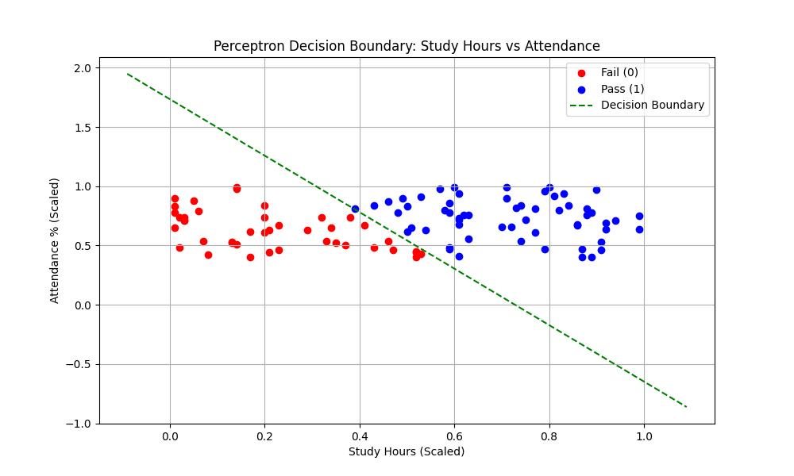
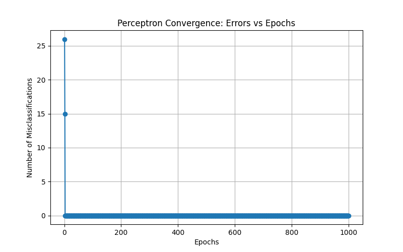

# Perceptron Implementation Report

## 1. Problem Statement
**Implement a Perceptron from Scratch**
The goal is to build a perceptron classifier from scratch using only NumPy to classify whether students will pass or fail based on their study hours and attendance percentage. The system employs a functional programming approach to train the model on synthetic data and predict outcomes for new students.

## 2. Concept Explanation: The Perceptron

### 2.1 Definition (What is it?)
A Perceptron is one of the simplest types of Artificial Neural Networks. It is a linear binary classifier that maps input features (like study hours and attendance) to a binary output (Pass/Fail) using a set of learned weights and a bias term.

### 2.2 Why is it used?
It is used to learn a linear decision boundary that separates data into two classes. It serves as the foundational building block for more complex neural networks (Deep Learning).

### 2.3 When to use it?
- When the problem is a **binary classification** task (e.g., Yes/No, Pass/Fail).
- When the data is **linearly separable** (i.e., you can draw a straight line to separate the two classes).

### 2.4 Where to use it?
- Simple logic gates implementation (AND, OR).
- Basic classification hurdles where computational efficiency is critical and relationships are linear.
- Educational purposes to understand the basics of Machine Learning.

### 2.5 How to use it? (Steps)
1.  **Initialize**: Start with random or zero weights and bias.
2.  **Activate**: Calculate the weighted sum of inputs ($z = w \cdot x + b$) and apply a step function (1 if $z \ge 0$, else 0).
3.  **Update**: Compare prediction with the actual label. If wrong, adjust weights towards the correct direction using the learning rate.
4.  **Repeat**: Iterate this process for many epochs until the model converges (stops making errors).

## 3. Advantages and Disadvantages

### Advantages
- **Simplicity**: Very easy to understand and implement.
- **Efficiency**: Fast training and prediction for small datasets.
- **Guarantee**: If data is linearly separable, the perceptron learning algorithm is guaranteed to find a solution.

### Disadvantages
- **Linear Limitation**: Cannot solve non-linear problems (e.g., XOR problem).
- **Convergence**: If data is not linearly separable, the learning algorithm will never stop updating (it oscillates).
- **Binary Only**: Natively supports only two classes (0 or 1).

## 4. Implementation Steps
1.  **Data Generation**: created a dataset of 100 students with `Study Hours` and `Attendance`. Labels were assigned based on the rule `Study + 0.5 * Attendance > 75`.
2.  **Normalization**: Scaled features by dividing by 100 to range them between 0 and 1. This significantly improves convergence speed and stability.
3.  **Function Definition**:
    - `step_function`: Acts as the activation.
    - `train_perceptron`: The core learning loop updating weights based on error.
    - `predict_perceptron`: Applies learned weights to new data.
4.  **Training**: Ran the algorithm for 1000 epochs with a learning rate of 0.1.
5.  **Visualization**: Plotted the data points and the calculated decision boundary line. Also tracked errors per epoch.

## 5. Execution Output

### Training Results
- **Model Accuracy**: **100.00%**
- **Converged Weights**: `[0.412, 0.173]`
- **Bias**: `-0.30`

### Test Predictions
| Student | Study Hours | Attendance | Prediction |
| :--- | :--- | :--- | :--- |
| **Student A** | 80 | 90% | **Pass** |
| **Student B** | 30 | 60% | **Fail** |
| **Student C** | 50 | 85% | **Pass** |

### Visualizations

#### Decision Boundary
The green line represents the "threshold" learned by the Perceptron. Students above the line Pass, those below Fail.

#### Convergence Plot
This plot shows how the number of errors decreased over training epochs.

## 6. Observations
1.  **Normalization Effect**: Initially, raw values (0-100) caused stability issues. Scaling them to (0-1) allowed the weights to adjust smoothly and converge to a perfect solution.
2.  **Perfect Separation**: Since the data was generated using a strict linear rule, the Perceptron achieved 100% accuracy, proving the data was linearly separable.
3.  **Weights Interpretation**: Positive weights for both Study Hours (0.412) and Attendance (0.173) confirm that both factors positively contribute to passing. The higher weight for Study Hours suggests it might be slightly more dominant in this specific learned boundary, or it's just a valid solution in the solution space.

## 7. Conclusion
The Perceptron successfully solved the student pass/fail classification problem. By implementing it from scratch without classes, we demonstrated the raw logic behind neural network training: **forward propagation** (linear sum + activation) and **backward update** (error-based weight adjustment). The model correctly predicted all test cases and handled the linearly separable synthetic data perfectly.
