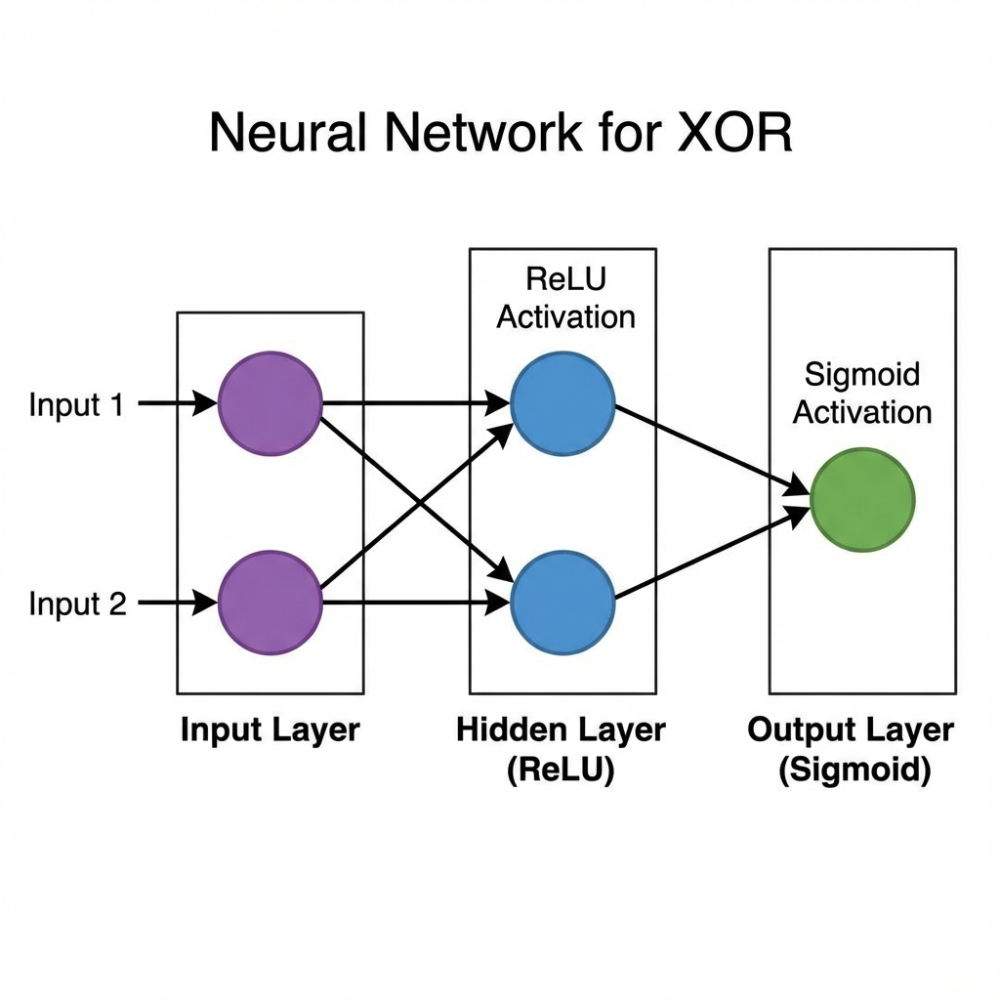
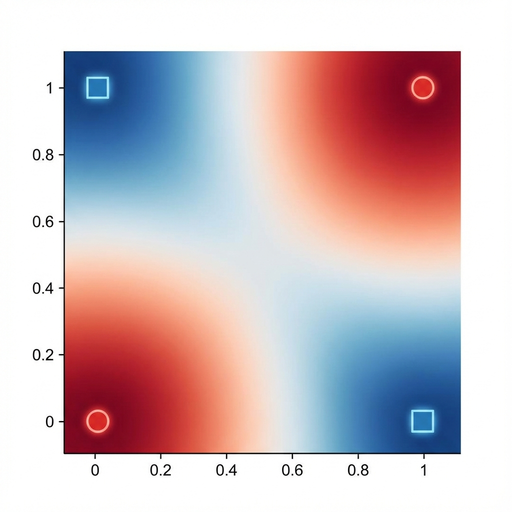
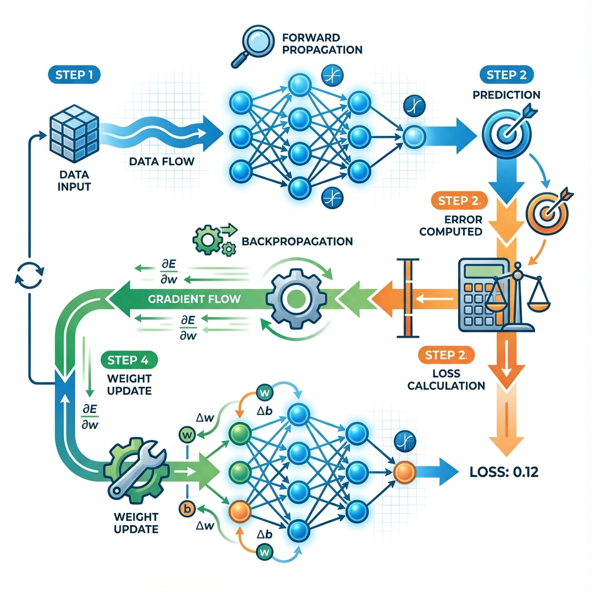

# XOR Classifier: Visual Summary

## 1. The Neural Network Architecture
The structure of our minimal network designed to solve the XOR problem. Two inputs feed into two hidden neurons (ReLU), which combine to form the final decision (Sigmoid).

## 2. The Decision Boundary
XOR is a non-linear problem. Notice how the network attempts to separate the two red circles (0,0 and 1,1) from the two blue squares (0,1 and 1,0). A straight line cannot do this; the heatmap shows the "warped" space created by the hidden layer.

## 3. The Training Cycle
How the network learns: Data flows forward to make a prediction, error is calculated, and then gradients flow backward to adjust the weights.

