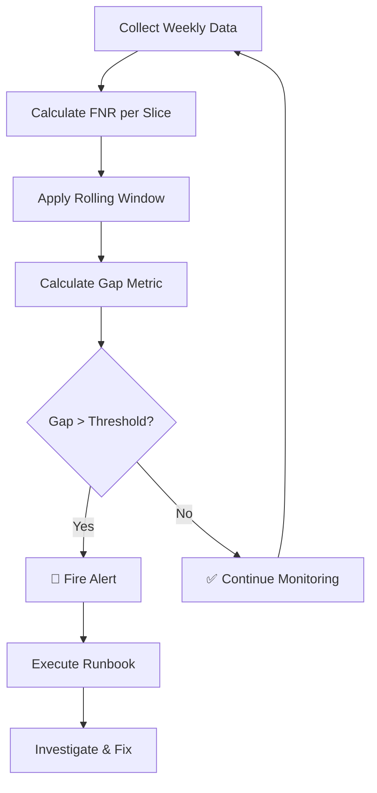

# 📊 FNR Gap Monitoring Alert System
## NotebookLM-Style Slide Deck

---

# Slide 1: Title & Objective

## 🚨 FNR Gap Monitoring Alert System
### Detecting Unequal Harm in Deployed Binary Classifiers

---

**Objective:**
Design a monitoring system that:
- Detects when different groups experience different error rates
- Alerts when disparity exceeds acceptable limits
- Provides clear response procedures

**Why It Matters:**
- ML models can perform well overall but harm specific groups
- Weekly labels enable continuous monitoring
- Fairness is a regulatory and ethical requirement

---

# Slide 2: Problem Statement

## 🧩 The Problem

**Scenario:**
- Binary classifier deployed in production (e.g., disease diagnosis)
- Labels available weekly
- Multiple operational slices (hospitals, devices)

**The Challenge:**
- Overall metrics look good
- But some groups experience **more missed cases** than others
- This is **unequal harm**

**Question:**
> How do we detect and respond to disparate performance across groups?

---

# Slide 3: Real-World Use Case

## 🏥 Healthcare Example

**Setting:**
- AI diagnostic system across 5 hospitals
- Predicts disease presence (positive/negative)

**Problem:**
- Overall FNR: 12% (seems acceptable)
- Hospital A FNR: 8% ✅
- Hospital C FNR: 22% ⚠️

**Impact:**
- Hospital C patients miss 22% of positive cases
- That's **1 in 5 cases missed**
- Delayed treatment, worse outcomes

**Other Applications:**
- Fraud detection (device type slices)
- Credit scoring (demographic slices)
- Security screening (location slices)

---

# Slide 4: Input Data / Inputs

## 📊 What Data Do We Need?

**Per Slice, Per Week:**

| Column | Description | Example |
|--------|-------------|---------|
| `week` | Week number | 1, 2, 3... |
| `slice` | Operational group | Hospital_A, Device_Mobile |
| `TP` | True Positives | 450 |
| `FN` | False Negatives | 50 |

**Example Input:**

```
week  slice         TP   FN
1     Hospital_A    447  53
1     Hospital_B    433  67
1     Hospital_C    419  81
```

**Frequency:** Labels available weekly

---

# Slide 5: Concepts Used (High Level)

## 🔑 Key Concepts

1. **FNR (False Negative Rate)**
   - How many positives we miss
   - FNR = FN / (TP + FN)

2. **Operational Slices**
   - Subgroups to monitor separately
   - Examples: Hospital, Device, Region

3. **Gap Metric**
   - Disparity between worst and best
   - Gap = max(FNR) - min(FNR)

4. **Alert Threshold**
   - When to fire alert
   - Example: Gap > 10%

5. **Rolling Window**
   - Aggregate over 4 weeks
   - Reduces noise

6. **Runbook**
   - What to do when alert fires

---

# Slide 6: Detailed Concepts Breakdown

## 📚 Deep Dive

### FNR (False Negative Rate)

```
FNR = FN / (TP + FN)
```

- Measures: % of positives we **missed**
- Range: 0 to 1 (0% to 100%)
- Lower is better

**Example:**
- TP = 85, FN = 15
- FNR = 15 / (85+15) = 0.15 (15%)

---

### Gap Metric

```
Gap = max_g(FNR_g) - min_g(FNR_g)
```

- Measures: Disparity between groups
- 0 = perfect equality
- Higher = more inequality

**Example:**
- Hospital_A FNR: 0.08
- Hospital_C FNR: 0.22
- Gap = 0.22 - 0.08 = 0.14 (14%)

---

### Rolling Window

- **Why?** Weekly data is noisy
- **How?** Aggregate over 4 weeks
- **Result:** Smoother, more stable metrics

---

# Slide 7: Step-by-Step Solution Flow

## 🪜 Algorithm Flow



**Steps:**
1. Collect TP, FN per slice per week
2. Calculate FNR for each slice
3. Aggregate over 4-week window
4. Compute Gap = max - min
5. Check if Gap > threshold (10%)
6. If yes → Alert + Runbook
7. If no → Continue monitoring

---

# Slide 8: Code Logic Summary

## 💻 Key Functions

### 1. Calculate FNR per Slice
```python
def calculate_fnr(tp, fn):
    return fn / (tp + fn)
```

### 2. Calculate Gap Metric
```python
def calculate_gap(fnr_dict):
    max_fnr = max(fnr_dict.values())
    min_fnr = min(fnr_dict.values())
    return max_fnr - min_fnr
```

### 3. Check Alert Threshold
```python
def check_alert(gap, threshold=0.10):
    return gap > threshold
```

### 4. Execute Runbook
```python
def execute_runbook(gap, worst_slice):
    # Print immediate actions
    # Notify stakeholders
    # Log investigation steps
```

---

# Slide 9: Important Functions & Parameters

## ⚙️ Key Parameters

| Parameter | Default | Description |
|-----------|---------|-------------|
| `ALERT_THRESHOLD` | 0.10 | Gap that triggers alert |
| `TIME_WINDOW_WEEKS` | 4 | Rolling window size |
| `OPERATIONAL_SLICES` | 5 | Number of groups |

### Function: `calculate_fnr_per_slice(tp, fn)`

| Parameter | Type | Description |
|-----------|------|-------------|
| `tp` | int | True Positives count |
| `fn` | int | False Negatives count |
| **Returns** | float | FNR between 0 and 1 |

### Function: `calculate_fnr_gap(fnr_dict)`

| Parameter | Type | Description |
|-----------|------|-------------|
| `fnr_dict` | Dict | Slice name → FNR |
| **Returns** | Tuple | (gap, worst_slice, best_slice) |

---

# Slide 10: Execution Output

## 📊 Sample Output

### When No Alert:
```
✅ NO ALERT: Week 4
Gap Value:     0.0823 (8.23%)
Threshold:     0.1000 (10.00%)
Status:        WITHIN LIMITS
```

### When Alert Fires:
```
🚨 ALERT FIRED: Week 6
Gap Value:     0.1124 (11.24%)
Threshold:     0.1000 (10.00%)
Status:        EXCEEDED

⚠️ WORST Device_Desktop: 0.2234 (22.34%)
✅ BEST  Hospital_A:      0.1042 (10.42%)
```

### Gap Over Time:
```
Week 4: Gap = 0.0823 ✅
Week 5: Gap = 0.0956 ✅
Week 6: Gap = 0.1124 🚨
Week 7: Gap = 0.1189 🚨
Week 8: Gap = 0.1245 🚨
```

---

# Slide 11: Observations & Insights

## 🔍 Key Findings

### Observation 1: Disparity Increases Over Time
- Week 4 Gap: 8.23%
- Week 8 Gap: 12.45%
- **Trend: Getting worse!**

### Observation 2: Consistent Worst Performer
- Device_Desktop always highest FNR
- Needs targeted investigation

### Observation 3: Alert Persistence
- Once alert fires, it stays active
- Indicates systemic issue (not noise)

### Observation 4: Early Warning Possible
- Week 5 at 95.6% of threshold
- Could add "warning zone"

---

## 💡 Recommendations

1. Investigate Device_Desktop immediately
2. Consider tiered alerts (warning + critical)
3. Check for data quality issues
4. May need model retraining

---

# Slide 12: Advantages & Limitations

## ✅ Advantages

| Advantage | Description |
|-----------|-------------|
| **Simple Metric** | Easy to calculate and explain |
| **Interpretable** | Gap in percentage points |
| **Actionable** | Clear threshold for action |
| **Flexible** | Works with any slice definition |
| **Automated** | Can run without human intervention |

---

## ❌ Limitations

| Limitation | Mitigation |
|------------|------------|
| **Only considers extremes** | Add median/variance analysis |
| **Sensitive to outliers** | Use rolling window |
| **Binary alert** | Add warning thresholds |
| **Needs labels** | Wait for ground truth |
| **Doesn't explain cause** | Combine with error analysis |

---

# Slide 13: Interview Key Takeaways

## 💼 Common Interview Questions

### Q1: What is FNR Gap?
**A:** The difference between the worst and best FNR across operational slices. It measures disparity in model performance.

### Q2: Why monitor slices separately?
**A:** Overall metrics can hide unfair performance. Slice monitoring reveals hidden harm to specific groups.

### Q3: How to set the threshold?
**A:** Consider:
- Historical gap values
- Business risk tolerance
- Regulatory requirements
- False alarm cost

### Q4: What's in a runbook?
**A:** Step-by-step actions:
- Immediate (24h): Notify, investigate
- Short-term (1 week): Root cause, document
- Follow-up (1 month): Fix, verify, improve

### Q5: Why use rolling window?
**A:** Weekly data is noisy. Rolling window smooths fluctuations for stable metrics.

---

# Slide 14: Conclusion

## 📌 Summary

### What We Built
- FNR Gap Monitoring Alert System
- Detects unequal harm across groups
- Alerts when disparity exceeds threshold
- Provides clear runbook for response

### Key Formula
```
Gap = max(FNR) - min(FNR)
```

### Key Threshold
```
Alert when Gap > 10%
```

### Key Actions
1. Define metric (FNR per slice)
2. Set threshold (10%)
3. Use rolling window (4 weeks)
4. Execute runbook when alert fires

---

## 🎯 Final Takeaway

> **"Overall accuracy can mask unequal harm. Slice-based monitoring with clear thresholds and runbooks is essential for responsible AI deployment."**

---

## 📚 Next Steps

1. **Practice:** Run the code yourself
2. **Customize:** Add your own slices
3. **Extend:** Add visualization
4. **Learn:** Study other fairness metrics

---

# 🙏 Thank You!

**Questions?**

---

*Created for learning Responsible AI and ML Monitoring*
